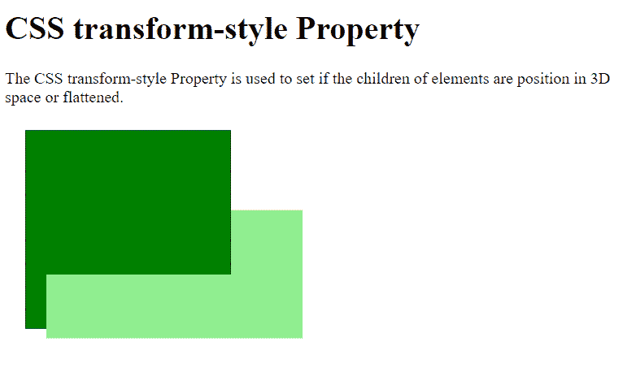
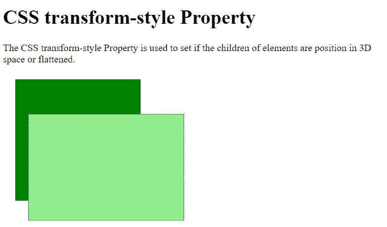

# CSS |变换样式属性

> 原文:[https://www.geeksforgeeks.org/css-transform-style-property/](https://www.geeksforgeeks.org/css-transform-style-property/)

**变换样式的**属性用于指定元素的子元素在三维空间中的位置或相对于元素平面的展平。

**语法:**

```css
transform-style: flat|preserve-3d|initial|inherit;
```

**属性值:**

*   **flat:** This value places the child elements in the same plane of the parent. It does not preserve the 3D position. It is the default value.

    **示例:**

    ```css
    <!DOCTYPE html>
    <html>

    <head>
        <style>
            .parent {
                margin: 20px;
                border: 1px dotted;
                height: 200px;
                width: 200px;
                background-color: green;
                transform: rotateX(15deg);
                transform-style: flat;
            }
            .child {
                margin: 20px;
                border: 1px dotted;
                height: 250px;
                width: 250px;
                background-color: lightgreen;
                transform: rotateX(45deg);
            }
        </style>
    </head>

    <body>
        <h1>CSS transform-style Property</h1>
        <p>
            The CSS transform-style Property is used
            to set if the children of elements are
            position in 3D space or flattened.
        </p>

        <div class="parent">
            <div class="child"></div>
        </div>
    </body>

    </html>
    ```

    **输出:**
    

*   **preserve-3d:** This value enables the child elements to preserve their 3D position.

    **示例:**

    ```css
    <!DOCTYPE html>
    <html>

    <head>
        <style>
            .parent {
                margin: 20px;
                border: 1px dotted;
                height: 200px;
                width: 200px;
                background-color: green;
                transform: rotateX(15deg);
                transform-style: preserve-3d;
            }
            .child {
                margin: 20px;
                border: 1px dotted;
                height: 250px;
                width: 250px;
                background-color: lightgreen;
                transform: rotateX(45deg);
            }
        </style>
    </head>

    <body>
        <h1>CSS transform-style Property</h1>

        <p>
            The CSS transform-style Property is used
            to set if the children of elements are
            position in 3D space or flattened.
        </p>

        <div class="parent">
            <div class="child"></div>
        </div>
    </body>

    </html>
    ```

    **输出:**
    

*   **initial:** This is used to set the property to its default value.

    **示例:**

    ```css
    <!DOCTYPE html>
    <html>

    <head>
        <style>
            .parent {
                margin: 20px;
                border: 1px dotted;
                height: 200px;
                width: 200px;
                background-color: green;
                transform: rotateX(15deg);
                transform-style: initial;
            }
            .child {
                margin: 20px;
                border: 1px dotted;
                height: 250px;
                width: 250px;
                background-color: lightgreen;
                transform: rotateX(45deg);
            }
        </style>
    </head>

    <body>
        <h1>CSS transform-style Property</h1>

        <p>
            The CSS transform-style Property is used
            to set if the children of elements are
            position in 3D space or flattened.
        </p>

        <div class="parent">
            <div class="child"></div>
        </div>
    </body>

    </html>
    ```

    **输出:**
    

*   **inherit:** It is used to inherit the property from its parent element.

    **示例:**

    ```css
    <!DOCTYPE html>
    <html>

    <head>
        <style>
            .main {
                transform-style: flat;
            }
            .parent {
                margin: 20px;
                border: 1px dotted;
                height: 200px;
                width: 200px;
                background-color: green;
                transform: rotateX(15deg);
                transform-style: inherit;
            }

            .child {
                margin: 20px;
                border: 1px dotted;
                height: 250px;
                width: 250px;
                background-color: lightgreen;
                transform: rotateX(45deg);
            }
        </style>
    </head>
    <body>
        <h1>CSS transform-style Property</h1>

        <p>
            The CSS transform-style Property is used
            to set if the children of elements are
            position in 3D space or flattened.
        </p>

        <div class="main">
            <div class="parent">
                <div class="child"></div>
            </div>
        </div>
    </body>

    </html>
    ```

    **输出:**
    

**支持的浏览器:**CSS 变换样式属性支持的浏览器如下:

*   Chrome 36.0、12.0 -webkit-
*   Internet Explorer 11.0
*   火狐 16.0， 10.0 -moz-
*   Safari 9.0，4.0 -webkit-
*   Opera 23.0，15.0 -webkit-