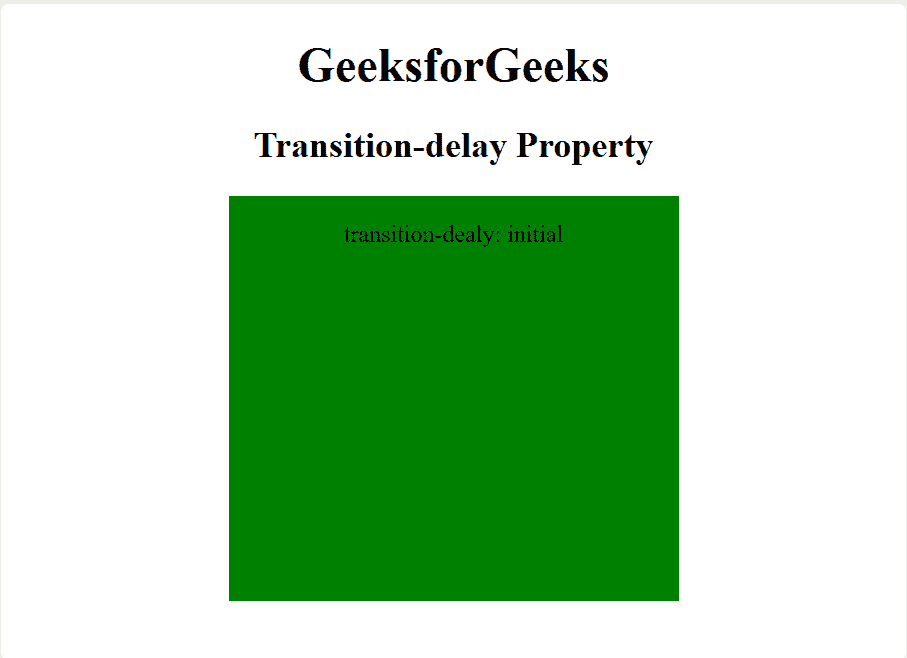
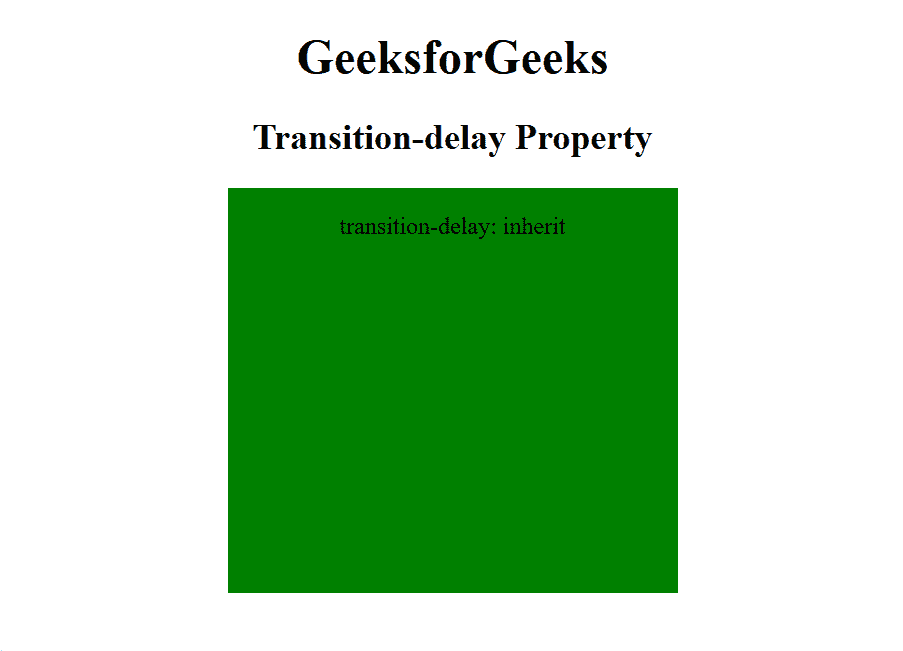

# CSS |转换延迟属性

> 原文:[https://www . geesforgeks . org/CSS-transition-delay-property/](https://www.geeksforgeeks.org/css-transition-delay-property/)

CSS 中的转换延迟属性用于指定开始转换的时间。以秒或毫秒为单位设置的转换延迟值。
**语法:**

```css
transition-delay: time|initial|inherit;
```

**房产价值:**

*   **时间:**指定开始过渡动画的时间长度(以秒或毫秒为单位)。
    **例:**

## 超文本标记语言

```css
<!DOCTYPE html>
<html>
    <head>
        <title>
            CSS transition-delay Property
        </title>

        <style>
            div {
                width: 100px;
                height: 270px;
                background: green;
                transition-property: width;
                transition-duration: 5s;
                transition-delay: 2s;

                /* For Safari browser */
                -webkit-transition-property: width;
                -webkit-transition-duration: 5s;
                -webkit-transition-delay: 2s;
                display: inline-block;
            }

            div:hover {
                width: 300px;
            }
        </style>
    </head>

    <body style = "text-align:center;">

        <h1>GeeksforGeeks</h1>

        <h2>Transition-delay Property</h2>

        <div>

<p>transition-delay: 2s</p>

        </div>
    </body>
</html>                   
```

**输出:**


*   **初始值:**它将转换延迟属性设置为默认值。
    **例:**

## 超文本标记语言

```css
<!DOCTYPE html>
<html>
    <head>
        <title>
            CSS transition-delay Property
        </title>

        <style>
            div {
                width: 100px;
                height: 270px;
                background: green;
                transition-property: width;
                transition-duration: 5s;
                transition-delay: initial;

                /* For Safari browser */
                -webkit-transition-property: width;
                -webkit-transition-duration: 5s;
                -webkit-transition-delay: initial;
                display: inline-block;
            }

            div:hover {
                width: 300px;
            }
        </style>
    </head>

    <body style = "text-align:center;">

        <h1>GeeksforGeeks</h1>

        <h2>Transition-delay Property</h2>

        <div>

<p>transition-delay: initial</p>

        </div>
    </body>
</html>                   
```

**输出:**



*   **inherit:** 该属性从其父元素继承而来。
    **例:**

## 超文本标记语言

```css
<!DOCTYPE html>
<html>
    <head>
        <title>
            CSS transition-delay Property
        </title>

        <style>
            div {
                width: 100px;
                height: 270px;
                background: green;
                transition-property: width;
                transition-duration: 5s;
                transition-delay: inherit;

                /* For Safari browser */
                -webkit-transition-property: width;
                -webkit-transition-duration: 5s;
                -webkit-transition-delay: inherit;
                display: inline-block;
            }

            div:hover {
                width: 300px;
            }
        </style>
    </head>

    <body style = "text-align:center;">

        <h1>GeeksforGeeks</h1>

        <h2>Transition-delay Property</h2>

        <div>

<p>transition-delay: inherit</p>

        </div>
    </body>
</html>                   
```

**输出:**



**注意:**过渡延迟属性的默认值为零。
**支持的浏览器:***过渡延迟属性*支持的浏览器如下:

*   谷歌 Chrome 26.0，4.0 -webkit-
*   Edge 10.0
*   火狐 16.0， 4.0 -moz-
*   Safari 6.1，3.1 -webkit-
*   歌剧 12.1，10.5 -o-