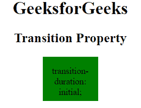

# CSS |过渡持续时间属性

> 原文:[https://www . geesforgeks . org/CSS-transition-duration-property/](https://www.geeksforgeeks.org/css-transition-duration-property/)

CSS 中的过渡持续时间属性用于指定完成过渡效果的时间长度(以秒或毫秒为单位)。

**语法:**

```css
transition-duration: time|initial|inherit;
```

**属性值:**

*   **time:** It is used to specify the length of time (in seconds or milliseconds) to complete transition animation.

    **语法:**

    ```css
    transition-duration: time;
    ```

    **示例:**

    ```css
    <!DOCTYPE html> 
    <html> 
        <head> 
            <title> 
                CSS transition-duration Property 
            </title> 

            <style> 
                div { 
                    width: 100px; 
                    height: 70px; 
                    background: green; 
                    transition-property: width;
                    transition-duration: 5s;

                    /* For Firefox browser */
                    -webkit-transition-property: width;
                    -webkit-transition-duration: 5s;
                    transition-delay: .2s; 
                    display: inline-block; 
                } 

                div:hover { 
                    width: 300px; 
                } 
            </style> 
        </head> 

        <body style = "text-align:center;"> 

            <h1>GeeksforGeeks</h1> 

            <h2>Transition Property</h2> 

            <div> 
                <p>transition-duration: 5s</p> 
            </div> 
        </body> 
    </html>                                   
    ```

    **输出:**

    *   过渡前:
        
    *   过渡后:
        
*   **initial:** It is used to set transition-duration property to its default value. The default value of transition-duration is 0.

    **语法:**

    ```css
    transition-duration: initial;
    ```

    **示例:**

    ```css
    <!DOCTYPE html> 
    <html> 
        <head> 
            <title> 
                CSS transition-duration Property 
            </title> 

            <style> 
                div { 
                    width: 100px; 
                    height: 80px; 
                    background: green; 
                    transition-property: width;
                    transition-duration: initial;

                    /* For Firefox browser */
                    -webkit-transition-property: width;
                    -webkit-transition-duration: initial;
                    transition-delay: .2s; 
                    display: inline-block; 
                } 

                div:hover { 
                    width: 300px; 
                } 
            </style> 
        </head> 

        <body style = "text-align:center;"> 

            <h1>GeeksforGeeks</h1> 

            <h2>Transition Property</h2> 

            <div> 
                <p>transition-duration: initial;</p> 
            </div> 
        </body> 
    </html>                                
    ```

    **输出:**

    *   过渡前:
        
    *   过渡后:
        
*   **inherit:** The value of transition-duration property set from its parent.

    **语法:**

    ```css
    transition-duration: inherit;
    ```

    **例 3:**

    ```css
    <!DOCTYPE html> 
    <html> 
        <head> 
            <title> 
                CSS transition-duration Property 
            </title> 

            <style> 
                div { 
                    width: 100px; 
                    height: 270px; 
                    background: green; 
                    transition-property: width;
                    transition-duration: inherit;
                    transition-timing-function: ease-in;
                                    transition-delay: .2s; 
                    display: inline-block; 
                } 

                div:hover { 
                    width: 500px; 
                } 
            </style> 
        </head> 

        <body style = "text-align:center;"> 

            <h1>GeeksforGeeks</h1> 

            <h2>Transition Property</h2> 

            <div> 
                <p>transition-duration: inherit</p> 
            </div> 
        </body> 
    </html>                    
    ```

    **输出:**

    *   Before Transition:
        

        **输出:**

    *   过渡后:
        

**支持的浏览器:***过渡时长属性*支持的浏览器如下:

*   Chrome 26.0，4.0 -webkit-
*   Edge 10.0
*   火狐 16.0， 4.0 -moz-
*   歌剧 12.1，10.5 -o-
*   Safari 6.1，3.1 -webkit-