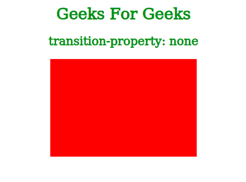
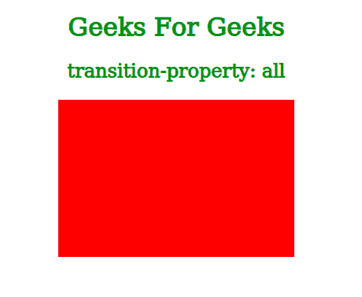
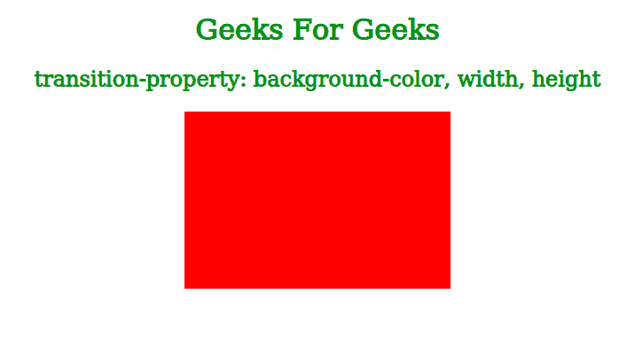
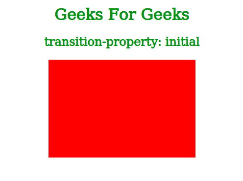
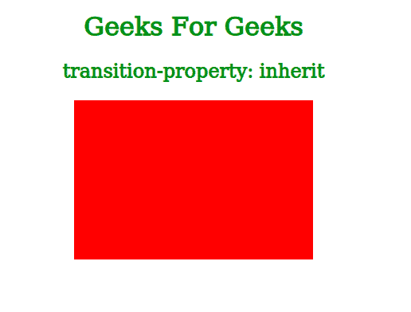

# CSS |过渡属性属性

> 原文:[https://www . geesforgeks . org/CSS-transition-property-property/](https://www.geeksforgeeks.org/css-transition-property-property/)

过渡效果用于显示指定持续时间内元素属性的变化。*过渡属性*属性用于指定将发生过渡效果的 CSS 属性的名称。

**语法:**

```css
transition-property: none | all | property | initial | inherit;

```

**属性值:**

*   **none:** This value is used to specify that no property will get a transition effect.

    **语法:**

    ```css
    transition-property: none;

    ```

    **示例:**在下面的示例中，我们已经指定没有属性会获得过渡效果。因此，如果我们将鼠标悬停在框上，其属性的变化将是突然的，而不是在指定的持续时间内从一个值转换到另一个值。

    ```css
    <!DOCTYPE html>
    <html>
      <head>
        <title>CSS transition-property property</title>
        <style>
          .box{
            background-color: red;
            width: 300px;
            height: 200px;
            margin: auto;
            transition-property: none;
            transition-duration: 2s;
          }

          .box:hover{
            background-color: pink;
            width: 200px;
            height: 150px;
          }

          h1, h2{
            color: green;
            text-align: center;
          }
        </style>
      </head>

      <body>
        <h1>Geeks For Geeks</h1>
        <h2>transition-property: none</h2>
        <div class="box"></div>
      </body>
    </html>
    ```

    **输出:**

    

*   **all:** All the CSS properties will get a transition effect. This is also the default value for this property.

    **语法:**

    ```css
    transition-property: all;

    ```

    **示例:**我们也可以使用 **all** 值作为过渡属性，而不是指定我们需要过渡效果的所有属性的名称。这将允许我们显示所有属性的转换效果，而无需单独指定它们的名称，如下例所示:

    ```css
    <!DOCTYPE html>
    <html>
      <head>
        <title>CSS transition-property property</title>
        <style>
          .box{
            background-color: red;
            width: 300px;
            height: 200px;
            margin: auto;
            transition-property: all;
            transition-duration: 2s;
          }

          .box:hover{
            background-color: pink;
            width: 200px;
            height: 150px;
          }

          h1, h2{
            color: green;
            text-align: center;
          }
        </style>
      </head>

      <body>
        <h1>Geeks For Geeks</h1>
        <h2>transition-property: all</h2>
        <div class="box"></div>
      </body>
    </html>
    ```

    **输出:**

    

*   **property:** We can specify the names of CSS properties for which transition effect will be applied. We can also specify multiple properties by separating them with a comma.

    **语法:**

    ```css
    transition-property: property;

    ```

    **示例:**在下面的示例中，我们通过用逗号分隔过渡效果(即背景色、宽度和高度)来指定多个属性。因此，当我们将鼠标悬停在框上时，我们可以看到框属性中的过渡。

    ```css
    <!DOCTYPE html>
    <html>
      <head>
        <title>CSS transition-property property</title>
        <style>
          .box{
            background-color: red;
            width: 300px;
            height: 200px;
            margin: auto;
            transition-property: background-color, width, height;
            transition-duration: 2s;
          }

          .box:hover{
            background-color: pink;
            width: 200px;
            height: 150px;
          }

          h1, h2{
            color: green;
            text-align: center;
          }
        </style>
      </head>

      <body>
        <h1>Geeks For Geeks</h1>
        <h2>
         transition-property: 
         background-color, width, height</h2>
        <div class="box"></div>
      </body>
    </html>
    ```

    **输出:**

    

*   **initial:** Used to set this property to its default value. This value is useful when we don’t know the default value for a specific property.

    **语法:**

    ```css
    transition-property: initial;

    ```

    **示例:**由于我们在下面的示例中将属性值指定为**初始值**，该属性的默认值(即 **all** )将被分配给*过渡属性*。因此，当我们将鼠标悬停在框上时，所有改变的 CSS 属性都会发生转换效果。

    ```css
    <!DOCTYPE html>
    <html>
      <head>
        <title>CSS transition-property property</title>
        <style>
          .box{
            background-color: red;
            width: 300px;
            height: 200px;
            margin: auto;
            transition-property: initial;
            transition-duration: 2s;
          }

          .box:hover{
            background-color: pink;
            width: 200px;
            height: 150px;
          }

          h1, h2{
            color: green;
            text-align: center;
          }
        </style>
      </head>

      <body>
        <h1>Geeks For Geeks</h1>
        <h2>transition-property: initial</h2>
        <div class="box"></div>
      </body>
    </html>
    ```

    **输出:**

    

*   **inherit:** Used to specify that this property will inherit its value from its parent element.

    **语法:**

    ```css
    transition-property: inherit;

    ```

    **示例:**由于我们已经将属性值指定为**继承**在下面的示例中，该框将继承其属性的*过渡属性*值。但是在这种情况下，其父级的*过渡属性*值将是 **all** (因为它是默认值)，因为我们没有为其父级指定该值。因此，所有 CSS 属性都会发生转换效果。

    ```css
    <!DOCTYPE html>
    <html>
      <head>
        <title>CSS transition-property property</title>
        <style>
          .box{
            background-color: red;
            width: 300px;
            height: 200px;
            margin: auto;
            transition-property: inherit;
            transition-duration: 2s;
          }

          .box:hover{
            background-color: pink;
            width: 200px;
            height: 150px;
          }

          h1, h2{
            color: green;
            text-align: center;
          }
        </style>
      </head>

      <body>
        <h1>Geeks For Geeks</h1>
        <h2>transition-property: inherit</h2>
        <div class="box"></div>
      </body>
    </html>
    ```

    **输出:**

    

**支持的浏览器:***过渡属性*支持的浏览器如下:

*   谷歌 Chrome
*   微软公司出品的 web 浏览器
*   火狐浏览器
*   歌剧
*   旅行队