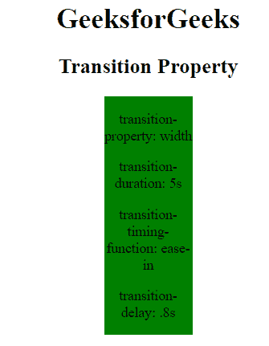
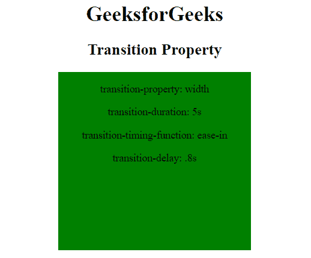

# CSS |过渡属性

> 原文:[https://www.geeksforgeeks.org/css-transition-property/](https://www.geeksforgeeks.org/css-transition-property/)

CSS 中的过渡属性用来做一些过渡效果。过渡是下面列出的四个属性的组合:

*   过渡性质
*   过渡持续时间
*   过渡定时功能
*   过渡延迟

**注意:**过渡效果可以使用伪类定义为两种状态(悬停和活动)，如:悬停或:活动或使用 JavaScript 动态设置的类。
**语法:**

```css
transition: transition-property transition-duration 
transition-timing-function transition-delay; 
```

**注意:**如果没有定义任何值，则浏览器采用默认值。
**房产价值:**

*   **过渡属性:**指定过渡效果应该应用到的 CSS 属性。
*   **过渡-持续时间:**它指定过渡动画完成所需的时间长度。
*   **过渡-定时-功能:**指定过渡速度。
*   **过渡-延迟:**指定过渡开始时的过渡延迟或时间。

**例:**

## 超文本标记语言

```css
<!DOCTYPE html>
<html>
    <head>
        <title>
            CSS transition Property
        </title>

        <style>
            div {
                width: 100px;
                height: 270px;
                background: green;
                transition: width 5s ease-in .2s;
                display: inline-block;
            }

            div:hover {
                width: 300px;
            }
        </style>
    </head>

    <body style = "text-align:center;">

        <h1>GeeksforGeeks</h1>

        <h2>Transition Property</h2>

        <div>

<p>transition-property: width</p>

<p>transition-duration: 5s</p>

<p>transition-timing-function: ease-in</p>

<p>transition-delay: .8s</p>

        </div>
    </body>
</html>                   
```

**输出:**

*   过渡效果前:



*   过渡效果后:



**支持的浏览器:**过渡属性支持的浏览器如下:

*   谷歌 Chrome 26.0，4.0 -webkit-
*   Internet Explorer 10.0
*   火狐 16.0， 4.0 -moz-
*   Safari 6.1，3.1 -webkit-
*   歌剧 12.1，10.5 -o-