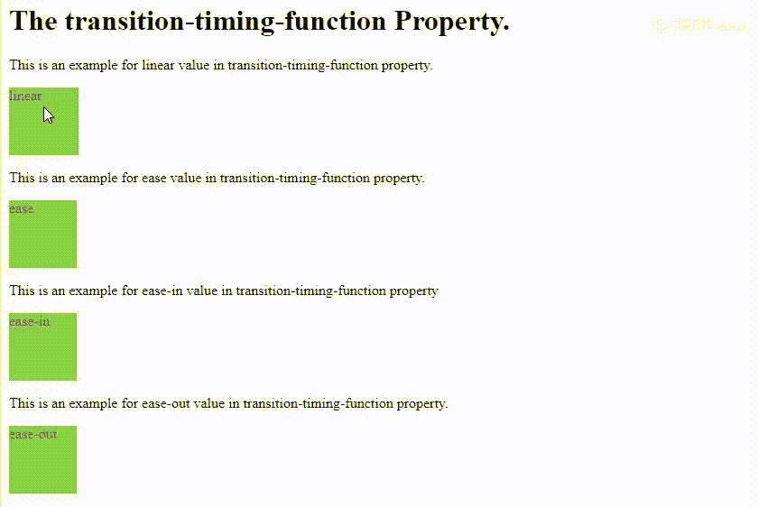

# CSS |过渡-定时-功能属性

> 原文:[https://www . geesforgeks . org/CSS-transition-timing-function-property/](https://www.geeksforgeeks.org/css-transition-timing-function-property/)

CSS 的**转换定时功能属性**描述了一个转换将如何在其持续时间内被展示。这将允许过渡在其过程中改变其速度和不同的运动属性。

转换定时功能指定动画从一组 CSS 转换到另一组 CSS 所用的时间。

过渡定时功能的默认值为**“缓和”**。该值将动画设置为慢速开始，然后在一段时间后速度增加，在结束之前速度再次变慢。

我们可以给这个属性赋予许多不同的值，其中一些是:

*   **线性**–在这种情况下，动画从头到尾的速度是一样的。
*   **缓和**–这类似于缓和，只是动画的结束很快。
*   **放松**–这也类似于放松，只是动画的开始很快。
*   **初始**–这将属性设置为默认值。

**示例:**

```html
<!DOCTYPE html>
<html>

<head>
    <style>
        div {
            height: 75px;
            width: 75px;
            background: yellowgreen;
            color: red;
            transition: width 5s;
        }

        #div1 {
            transition-timing-function: linear;
        }

        #div2 {
            transition-timing-function: ease;
        }

        #div3 {
            transition-timing-function: ease-in;
        }

        #div4 {
            transition-timing-function: ease-out;
        }

        div:hover {
            width: 300px;
        }
    </style>
</head>

<body>
    <h1>The transition-timing-function Property.</h1>
    <p>
        This is an example for linear 
      value in transition-timing-function property.
        <div id="div1">linear</div>
    </p>
    <p>
        This is an example for ease 
      value in transition-timing-function property.
        <div id="div2">ease</div>
    </p>
    <p>
        This is an example for ease-in 
      value in transition-timing-function property
        <div id="div3">ease-in</div>
    </p>
    <p>
        This is an example for ease-out 
      value in transition-timing-function property.
        <div id="div4">ease-out</div>
    </p>
</body>

</html>
```

**输出:**
