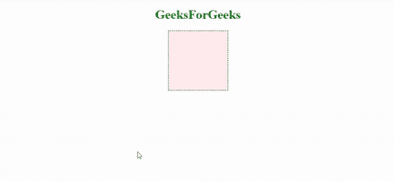
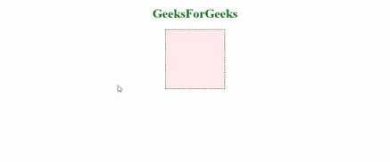

# CSS |转场

> 原文:[https://www.geeksforgeeks.org/css-transitions/](https://www.geeksforgeeks.org/css-transitions/)

CSS 中的转换允许我们控制元素的两种状态之间的转换方式。例如，将鼠标悬停在按钮上时，可以借助 CSS 选择器和[伪类](https://www.geeksforgeeks.org/css-pseudo-classes/)来更改元素的背景颜色。不过，我们可以更改任何其他属性或属性组合。过渡使我们能够确定颜色的变化是如何发生的。我们可以使用过渡来制作变化的动画，并使变化在视觉上吸引用户，从而提供更好的用户体验和交互性。在本文中，我们将向您展示如何在 CSS 属性之间制作过渡动画。

有四个 CSS 属性，你应该全部或部分使用(至少两个，过渡属性和过渡持续时间，是必须的)，来激活过渡。所有这些属性必须与元素初始状态的其他 CSS 属性放在一起:

1.  **transition-property:** This property allows you to select the CSS properties which you want to animate during transition(change).

    **语法:**

    ```html
    transition-property: none | all | property | property1,
    property2, ..., propertyN;

    ```

    **值**:

    *   **无**用于指定不应选择任何属性。
    *   **all** 用于指定所有要选择的属性，虽然不是所有属性都是可动画化的，但是只有可动画化的属性会受到影响。
    *   我们可以指定单个**属性**或一组逗号分隔的属性**属性 1、属性 2、…、属性**。
2.  **transition-duration:** This property allows you to determine how long it will take to complete the transition from one CSS property to the other.

    **语法:**

    ```html
    transition-duration: time;

    ```

    这里，**时间**可以是秒(s)或者毫秒(ms)，你应该在数字后面用‘s’或者‘ms’(不带引号)。

3.  **transition-timing-function:** This property allows you to determine the speed of change and the manner of change, during the transition. Like, the change should be fast at the beginning and slow at the end, etc.

    **语法:**

    ```html
    transition-timing-function: ease|ease-in|ease-out|ease-in-out|linear|
    step-start|step-end;

    ```

    注意，这个转换定时函数还可以取其他值，这里只提到最频繁和最简单的值。

4.  **transition-delay:** This property allows you to determine the amount of time to wait before the transition actually starts to take place.

    **语法:**

    ```html
    transition-delay: time;

    ```

    这里，同样，**时间**可以是秒(s)或毫秒(ms)，你应该在数字后使用‘s’或‘ms’(不带引号)。

**速记属性**根据下面给出的语法，您可以将上面提到的所有四个过渡属性组合成一个速记属性。这样我们就不用写长代码，也不会弄得一团糟。注意属性的排序，它有意义。

**语法:**

```html
transition: (property name) | (duration) | (timing function) | (delay);

```

取值同上。此属性必须与初始状态的其他 CSS 属性(如果有)放在一起。你应该至少使用**属性名**和**持续时间**来获得任何可动画化的效果。此外，价值观的排序也很重要。第一个值是属性名，第二个值是持续时间，依此类推，如上所列。因此，如果只提到一个数字，它将作为持续时间，而不是作为延迟。

**示例:**在不使用过渡的情况下更改属性。

```html
<!DOCTYPE html>
<html>
  <head>
    <title>CSS Transition</title>

    <style>
      h1{
        color: green;
        text-align: center;
      }
      div.one{
        height: 150px;
        width: 150px;
        border: 1px dashed black;
        margin: 0 auto;
        background: #FFEBEE;
      }
      div.one:hover{
        height: 300px;
        width: 300px;
        background: #BBDEFB;
      }
    </style>

  </head>

    <body>

       <h1>GeeksForGeeks</h1>

       <div class="one">
       </div>

  </body>
</html>
```

**输出:**


**示例:**使用过渡改变属性。

```html
<!DOCTYPE html>
<html>
  <head>
    <title>CSS Transition</title>

    <style>
      h1{
        color: green;
        text-align: center;
      }
      div.one{
        height: 150px;
        width: 150px;
        border: 1px dashed black;
        margin: 0 auto;
        background: #FFEBEE;
        transition: height 2s, width 2s, background 2s;
      }
      div.one:hover{
        height: 300px;
        width: 300px;
        background: #BBDEFB;
      }
    </style>

  </head>

  <body>

    <h1>GeeksForGeeks</h1>

    <div class="one">
    </div>

  </body>

</html>
```

**输出:**


**支持的浏览器:***过渡*支持的浏览器如下:

*   谷歌 Chrome
*   微软公司出品的 web 浏览器
*   火狐浏览器
*   歌剧
*   旅行队