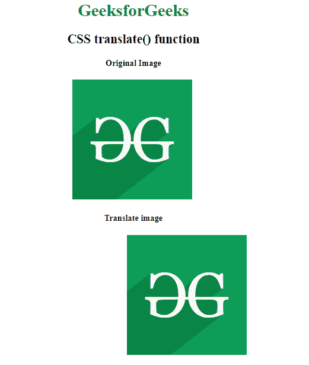
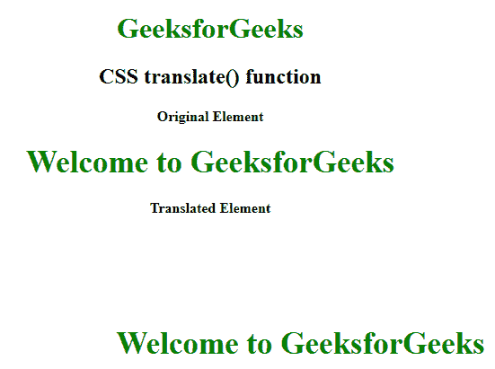

# CSS | translate()函数

> 原文:[https://www.geeksforgeeks.org/css-translate-function/](https://www.geeksforgeeks.org/css-translate-function/)

**translate()函数**是一个内置函数，用于在水平和垂直方向重新定位元素。

**语法:**

```css
translate( tx )
```

或者

```css
translate( tx, ty )
```

**参数:**

*   **tx:** 此参数保存 x 轴对应的平移长度。
*   **ty:** 此参数保存对应 y 轴的平移长度。如果未定义其值，则取 0 作为默认值。

下面的例子说明了 CSS 中的 translate()函数:

**例 1:**

```css
<!DOCTYPE html> 
<html> 

<head> 
    <title>CSS translate() function</title> 

    <style> 
        body {
            text-align:center;
        }
        h1 {
            color:green;
        }
        .translate_image {
            transform: translate(100px, 0);
        }
    </style> 
</head> 

<body> 
    <h1>GeeksforGeeks</h1>
    <h2>CSS translate() function</h2>

    <h4>Original Image</h4>
    
    <br>

    <h4>Translate image</h4>
     
</body> 

</html>
```

**输出:**


**例 2:**

```css
<!DOCTYPE html> 
<html> 

<head> 
    <title>CSS translate() function</title> 

    <style> 
        body {
            text-align:center;
        }
        h1 {
            color:green;
        }
        .GFG {
            font-size:35px;
            font-weight:bold;
            color:green;
        }
        .geeks {
            transform: translate(100px, 100px);
        }
    </style> 
</head> 

<body> 
    <h1>GeeksforGeeks</h1>
    <h2>CSS translate() function</h2>

    <h4>Original Element</h4>
    <div class="GFG">Welcome to GeeksforGeeks</div>

    <h4>Translated Element</h4>
    <div class="GFG geeks">Welcome to GeeksforGeeks</div> 
</body> 
</html>
```

**输出:**


**支持的浏览器:**translate()函数支持的浏览器如下:

*   谷歌 Chrome
*   微软公司出品的 web 浏览器
*   火狐浏览器
*   旅行队
*   歌剧