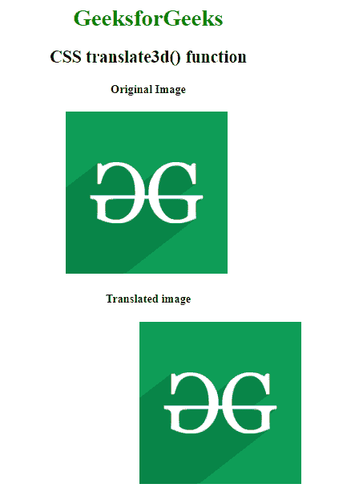

# CSS | translate3d()函数

> 原文:[https://www.geeksforgeeks.org/css-translate3d-function/](https://www.geeksforgeeks.org/css-translate3d-function/)

**translate3d()函数**是一个内置函数，用于在 3d 空间中重新定位元素。

**语法:**

```css
translate3d( tx, ty, tz )
```

**参数:**该功能接受三个参数，如上所述，描述如下:

*   **tx:** 此参数保存 x 轴对应的平移长度。此参数以数字或百分比的形式保存值。
*   **ty:** 此参数保存对应 y 轴的平移长度。此参数以数字或百分比的形式保存值。
*   **tz:** 该参数保存 z 轴对应的平移长度。此参数仅保存数字形式的值。

下面的例子说明了 CSS 中的 translate3d()函数:

**例 1:**

```css
<!DOCTYPE html>
<html>

<head>
    <title>
      CSS translate3d() function
  </title>
    <style>
        body {
            text-align: center;
        }

        h1 {
            color: green;
        }

        .translate3d_image {
            transform: translate3d(100px, 0, 0);
        }
    </style>
</head>

<body>
    <h1>GeeksforGeeks</h1>
    <h2>CSS translate3d() function</h2>

    <h4>Original Image</h4>
    
    <br>

    <h4>Translated image</h4>
    
</body>

</html>
```

**输出:**


**例 2:**

```css
<!DOCTYPE html> 
<html> 
<head> 
    <title>CSS translate3d() function</title> 
    <style> 
        body {
            text-align:center;
        }
        h1 {
            color:green;
        }
        .GFG {
            font-size:35px;
            font-weight:bold;
            color:green;
        }
        .geeks {
            transform: translate3d(100px, 20px, 0);
        }
    </style> 
</head> 

<body> 
    <h1>GeeksforGeeks</h1>
    <h2>CSS translate3d() function</h2>

    <h4>Original Element</h4>
    <div class="GFG">Welcome to GeeksforGeeks</div>

    <h4>Translated Element</h4>
    <div class="GFG geeks">Welcome to GeeksforGeeks</div> 
</body> 
</html>
```

**输出:**


**支持的浏览器:****translate 3d()功能**支持的浏览器如下:

*   谷歌 Chrome
*   微软公司出品的 web 浏览器
*   火狐浏览器
*   旅行队
*   歌剧