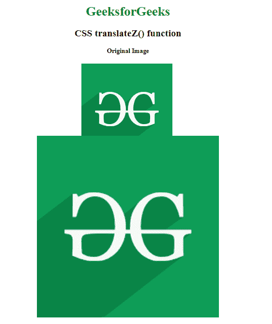

# CSS | translation()函数

> 原文:[https://www.geeksforgeeks.org/css-translatez-function/](https://www.geeksforgeeks.org/css-translatez-function/)

**translateZ()函数**是一个内置函数，用于在 3D 空间中沿 z 轴重新定位元素。

**语法:**

```
translateZ( t )
```

**参数:**该功能接受单参数 **t** ，该参数保存 z 轴对应的平移长度。

下面的例子说明了 CSS 中的 translateZ()函数:

**例 1:**

```
<!DOCTYPE html>
<html>

<head>
    <title>
      CSS translateZ() function
  </title>
    <style>
        body {
            text-align: center;
        }

        h1 {
            color: green;
        }

        .translateZ_image {
            transform: perspective(200px) translateZ(100px);
        }
    </style>
</head>

<body>
    <h1>GeeksforGeeks</h1>
    <h2>CSS translateZ() function</h2>

    <h4>Original Image</h4>
    
    <br>

    <h4>Translated image</h4>
    
</body>

</html>
```

**输出:**


**例 2:**

```
<!DOCTYPE html>
<html>

<head>
    <title>
      CSS translateZ() function
  </title>
    <style>
        body {
            text-align: center;
        }

        h1 {
            color: green;
        }

        .GFG {
            font-size: 35px;
            font-weight: bold;
            color: green;
        }

        .geeks {
            transform: perspective(
              200px) translateZ(100px);
        }
    </style>
</head>

<body>
    <h1>GeeksforGeeks</h1>
    <h2>CSS translateZ() function</h2>

    <h4>Original Element</h4>
    <div class="GFG">
      Welcome to GeeksforGeeks
  </div>

    <h4>Translated Element</h4>
    <div class="GFG geeks">
      Welcome to GeeksforGeeks
  </div>
</body>

</html>
```

**输出:**


**支持的浏览器:****translateZ()功能**支持的浏览器如下:

*   谷歌 Chrome
*   微软公司出品的 web 浏览器
*   火狐浏览器
*   旅行队
*   歌剧