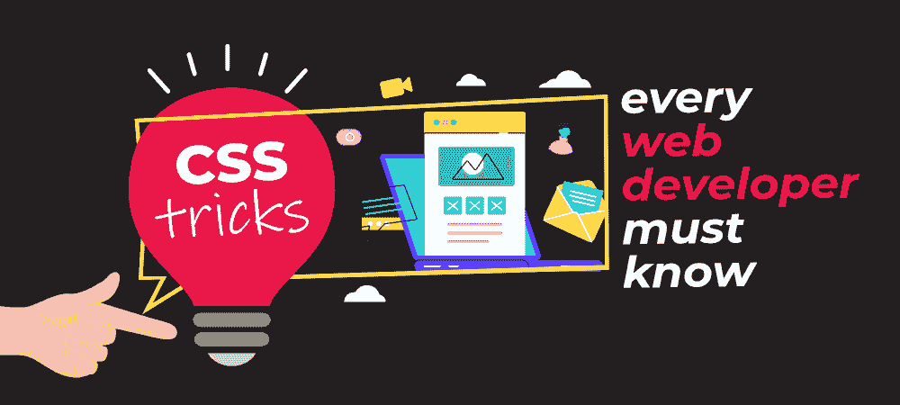

# 每个网络开发者都应该知道的 CSS 技巧

> 原文:[https://www . geesforgeks . org/CSS-每一个网络开发者都应该知道的技巧/](https://www.geeksforgeeks.org/css-tricks-that-every-web-developer-should-know/)

**级联样式表……**如果你是一个全栈开发人员或者前端工程师，那么你肯定会在你的应用程序中使用 CSS。CSS 在让你的网站变得美观和吸引人方面起着重要的作用。一个漂亮的用户界面总是吸引用户，这成为用户在网站上停留很长时间的一个很好的理由。

学习 [CSS](https://www.geeksforgeeks.org/css-tutorials/) 很容易，在你的 web 应用中使用和玩它的属性也很有趣。但是很少有人掌握它。当应用程序中的事物或样式没有按照他们希望的方式运行时，它会让开发人员感到恼火。为应用程序编写 CSS 类似于解谜。您尝试不同的属性，并在应用自己的样式后检查应用程序的外观。



您不需要为每个 HTML 元素编写样式。你的 CSS 让你的 HTML 代码变小了。你会发现为你的网站创建一个漂亮的设计是很容易的。写一个完美的 CSS 并不容易，但是如果你是这方面的大师，那么你肯定会节省很多时间。另外，你不必和设计师讨论这个问题。

在这个博客中，我们将讨论 CSS 的一些技巧，这些技巧将帮助你为你的项目写好 CSS。遵循这些技巧将使您成为更好的开发人员…

### 技巧 1:让你的按钮变得完美

按钮是每个 web 应用程序的常见元素。无论是需要提交表单、重定向到不同页面、购买物品、还是发送邮件，大多数情况下，你都会使用按钮来完成这些任务。无论什么按钮都能吸引用户的注意力，让你的按钮变得完美很重要。不同的程序员  遵循不同的方法得到相同的结果。类似的事情发生在 CSS 中。下面是一些让你的按钮变得完美的小技巧…

*   **大小:**区域应该是至少 40×40 px，让你的按钮可以在移动设备上点击。
*   **框影:**添加框影为你的按钮创建一个深度效果。
*   **最小宽度:**当您看到按钮中的文本太短时，请为按钮的最小尺寸添加最小宽度。要将文本居中对齐，请在 CSS 中使用**文本对齐:居中**属性。
*   **悬停:**你悬停CSS 的属性使你的按钮交互。这会吸引用户的注意力。悬停将鼠标悬停在按钮上时，更改按钮的颜色。它很容易吸引用户的注意力。
*   **过渡:**添加颜色过渡，添加和额外的接触。
*   **圆角:**可选，但圆角按钮也能抓住用户的注意力。
*   **行高** :使用行高垂直居中按钮中的文本。行高设置 a 单线时的线与 a 显示的元素之间的间距。举例如下……

```html
//CSS
button {
 margin: 30px;
 line-height: 60px;
 min-width: 160px;
 font-family: Arial, sans-serif;
 background-color: #FD310F;
 border-radius: 4px;
 text-align: center;
 border: 0;
 cursor: pointer;
 color: #fff;
 box-shadow: 0 0 5px rgba(0, 0, 0, 0.5);
 transition: background-color 0.3s ease-in-out;
}

button:hover {
 background-color: #0000ff;
}
```

### 技巧 2:按钮栏

您可以在按钮栏中用不同的操作对按钮进行分组。在这组按钮中，按钮的总数或按钮的大小会让开发人员感到困惑。对于不同的按钮，您可能需要不同的设计，这里编写 CSS 对您来说变得很困难。在这种情况下你不能灵活。要解决这个问题，您可以编写下面给出的代码…

## 超文本标记语言

```html
<div class="button-bar">
<button>Add to Cart</button>
<button>Buy Now</button>
</div>
```

```html
//CSS
.button-bar {
background-color: #00FF00;
padding: 0 7px;
text-align: right;
}
.button-bar button {
margin: 20px 12px;
display: inline-block;
}
```

### 技巧 3:调整图像大小

调整图像大小也是一项具有挑战性的任务。在您的 web 应用程序中，您不希望图像放大。很多时候，图像会变得模糊，图像分辨率很低。图像应该小，以避免这类问题。大多数情况下，我们用像素来表示图像。为图像定义特定的大小。这个想法是使图像的原始尺寸最大化。如果图像的大小是 200 像素，那么保持最大宽度 200 像素。

你能尝试的最好的技巧是用百分比来定义图像的大小。最大宽度和屏幕宽度之间的比率，然后可以将最大宽度设置为屏幕宽度的一定百分比。

您可以考虑一个场景，其中图像宽 400px，宽度设置为 100%。下面给出了可能发生的两件事。

*   如果屏幕的尺寸是 800 像素宽，那么最大宽度就是 800 像素。这里图像的宽度只有 400px。这实际上会显示为 400 像素。
*   如果图像比你的屏幕大，例如屏幕是 300 像素，最大宽度设置为 100%，那么图像将缩放到 300 像素宽。

```html
<div class="content">

</div>
```

```html
.content{
/* Min space between image and window */
padding: 30px;
}
.content img{
display: block;
margin: 0 auto;
max-width: 100%;
}
```

### 技巧 4: **固定标题**

我们都在应用程序的顶部使用标题。头球看起来不错，但很难做出完美的头球。你可能在每个网站上都观察到标题是粘性的。这个属性是通过使用**位置来实现的:固定**为表头。但是在这一页的开始，你将面对一个空白。

当你需要调整页面大小时，你将面临这个问题。当您需要调整空间时，割台的高度将会改变。你也将面对的和【滚动条】的问题。其中一部分将被表头覆盖。为了克服这个问题，使用 CSS 的弯曲属性。

## 超文本标记语言

```html
<div class="page">
<div class="header">Logo</div>
<div class="content">
  <!-- Content Page -->
</div>
</div>
```

```html
//CSS
.page{
height: 100%;
display: flex;
flex-direction: column;
overflow: hidden;
}
.page .header{
background-color: #000;
line-height: 30px;
color: #fff;
text-align: center;
}
.page .content{
flex: 1;
overflow: auto;
}
```

### **技巧 5:中心内容**

没有一个网站没有内容。对于用户界面开发人员来说，在将内容放在不同的页面上并赋予它们风格时要小心。任何网站上的内容都应该正确放置，并且在多种分辨率的多台设备上应该看起来不错。这也是一项具有挑战性的任务。

大多数开发人员使用媒体查询来解决这个问题。在内容中添加媒体查询会使事情变得复杂，因为您可能需要为不同的分辨率添加不同的媒体查询代码。

要解决这个问题，您可以根据浏览器的大小调整页面内容的大小。这里你需要考虑 div 里面的内容是一个文本。在这里，当每行大约为 1300-1500 像素时，将很难阅读。您需要限制内容的宽度。水平居中，因为它不会覆盖更高分辨率的整个宽度。

以下是解决此问题的解决方案…

*   **最大宽度:**您需要将页面大小限制在最大宽度
*   **边距:“0-自动”-** 该属性将设置相同的左右边距，这将使用“class=page”水平居中 div
*   **填充:**在屏幕和内容之间创建一些空间****。****

## ****超文本标记语言****

```html
**<div class="page">

<p><!-- Content Page --></p>

</div>**
```

```html
**// CSS
body{
padding: 30px;
font-family: Arial, sans-serif;
}
.page{
background-color: #0000FF;
box-shadow: 0 0 5px rgba(0, 0, 0, 0.5);
border-radius: 4px;
margin: 0 auto;
max-width: 600px;
padding: 30px;
}**
```

### ****结论****

****当你开始你的职业生涯时，你会使用 CSS，你会学到很多东西，但是编写完美的 CSS 并不容易。它伴随着练习和看到别人的代码而来。玩转你的代码，看看它如何影响你的 web 应用程序。这样做你会明白很多事情。****