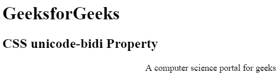
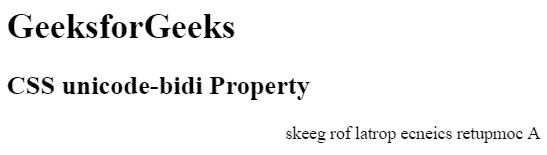

# CSS | unicode-bidi 属性

> 原文:[https://www.geeksforgeeks.org/css-unicode-bidi-property/](https://www.geeksforgeeks.org/css-unicode-bidi-property/)

HTML DOM 中的 **unicode-bidi** 属性与方向属性一起应用，以确定如何在文档中处理双向文本。

**语法:**

```html
unicode-bidi: normal|embed|bidi-override|initial|inherit;
```

**属性值:**

*   **normal:** It is the default value. The additional level of embedding does not open from the element.

    **语法:**

    ```html
    unicode-bidi: normal;
    ```

    **示例:**

    ```html
    <!DOCTYPE html>
    <html>

    <head>
        <title>
            CSS unicode-bidi Property
        </title>

        <!-- style for unicode-bidi property -->
        <style>
            .GFG {
                direction: rtl;
                unicode-bidi: normal;
            }
        </style>
    </head>

    <body>
        <h1>GeeksforGeeks</h1>

        <h2>
            CSS unicode-bidi Property
        </h2>

        <div class = "GFG">
            A computer science portal for geeks
        </div>
    </body>

    </html>                    
    ```

    **输出:**
    

*   **embed:** This value is used to open an additional level of embedding.

    **语法:**

    ```html
    unicode-bidi:embed;
    ```

    **示例:**

    ```html
    <!DOCTYPE html>
    <html>

    <head>
        <title>
            CSS unicode-bidi Property
        </title>

        <!-- style for unicode-bidi property -->
        <style>
            .GFG {
                direction: rtl;
                unicode-bidi: embed;
            }
        </style>
    </head>

    <body>
        <h1>GeeksforGeeks</h1>

        <h2>
            CSS unicode-bidi Property
        </h2>

        <div class = "GFG">
            A computer science portal for geeks
        </div>
    </body>

    </html>                    
    ```

    **输出:**
    

*   **bidi-override:** This value creates an override for inline element and in case of block element, it creates an override for inline-level descendants not within another block element.

    **语法:**

    ```html
    unicode-bidi:bidi-override;
    ```

    **示例:**

    ```html
    <!DOCTYPE html>
    <html>

    <head>
        <title>
            CSS unicode-bidi Property
        </title>

        <!-- style for unicode-bidi property -->
        <style>
            .GFG {
                direction: rtl;
                unicode-bidi: bidi-override;
            }
        </style>
    </head>

    <body>
        <h1>GeeksforGeeks</h1>

        <h2>
            CSS unicode-bidi Property
        </h2>

        <div class = "GFG">
            A computer science portal for geeks
        </div>
    </body>

    </html>                    
    ```

    **输出:**
    

*   **initial:** It sets the unicode-bidi property to its default value.

    **语法:**

    ```html
    unicode-bidi: initial;
    ```

    **示例:**

    ```html
    <!DOCTYPE html>
    <html>

    <head>
        <title>
            CSS unicode-bidi Property
        </title>

        <!-- style for unicode-bidi property -->
        <style>
            .GFG {
                direction: rtl;
                unicode-bidi: initial;
            }
        </style>
    </head>

    <body>
        <h1>GeeksforGeeks</h1>

        <h2>
            CSS unicode-bidi Property
        </h2>

        <div class = "GFG">
            A computer science portal for geeks
        </div>
    </body>

    </html>                    
    ```

    **输出:**
    

*   **inherit:** The unicode-bidi property is inherited from its parent element.

    **语法:**

    ```html
    unicode-bidi: inherit;
    ```

    **示例:**

    ```html
    <!DOCTYPE html>
    <html>

    <head>
        <title>
            CSS unicode-bidi Property
        </title>

        <!-- style for unicode-bidi property -->
        <style>
            .Geeks {
                direction: rtl;
                unicode-bidi: bidi-override;
            }
            .GFG {
                unicode-bidi: inherit;
            }
        </style>
    </head>

    <body>
        <h1>GeeksforGeeks</h1>

        <h2>
            CSS unicode-bidi Property
        </h2>

        <div class = "Geeks">
            <div class = "GFG">
                A computer science portal for geeks
            </div>
        </div>
    </body>

    </html>                    
    ```

    **输出:**
    

*   **isolate-override:** It applies the isolation behavior of the isolate keyword to the surrounding content and the override behavior of the bidi-override to the inner content.

    **语法:**

    ```html
    unicode-bidi: isolate-override;
    ```

*   **plaintext:** It makes the element directionality calculated without considering its parent bidirectional state or the value of the direction property.

    **语法:**

    ```html
    unicode-bidi: plaintext;
    ```

**支持的浏览器:***unicode-bidi 属性*支持的浏览器如下:

*   谷歌 Chrome 2.0
*   Internet Explorer 5.5
*   Firefox 1.0
*   Safari 1.3
*   歌剧 9.2