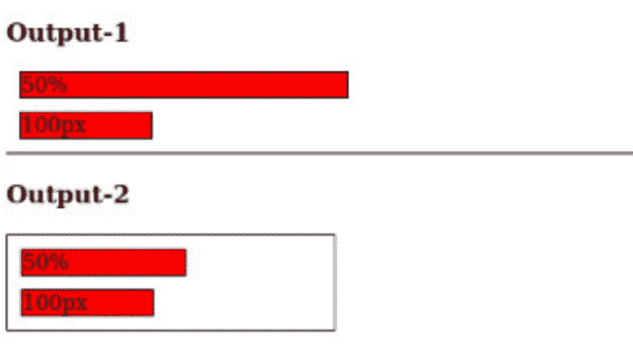
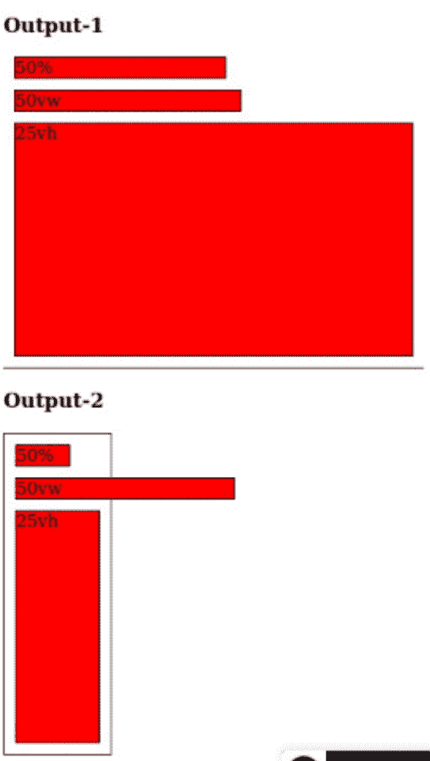
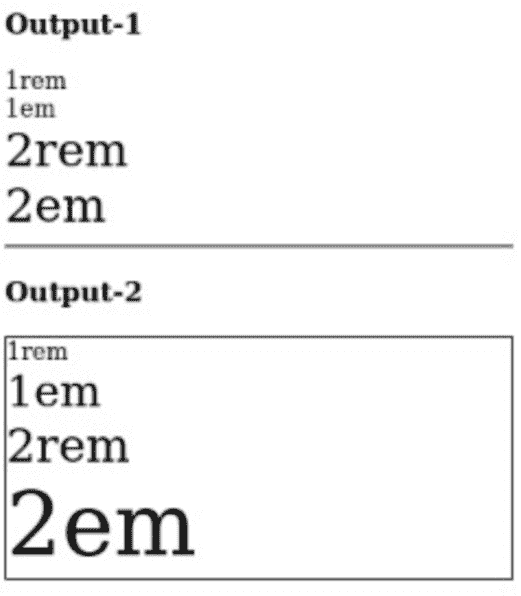

# CSS 单位─%，em、rem、px、vh、vw

> 原文:[https://www.geeksforgeeks.org/css-units-em-rem-px-vh-vw/](https://www.geeksforgeeks.org/css-units-em-rem-px-vh-vw/)

在本文中，我们将看到如何以不同的方式设置 CSS 单位。

*   **%–**%单位用于设置相对于当前字体大小的字体大小。
*   **em–**用于设置 r 相对大小。它与元素的字体大小有关。
    **注:** 此处 2em 表示当前字体的 2 倍大小。
*   **rem–**相对于浏览器基本字号。
*   **px–**以像素为单位定义字体大小。(96px = 1 英寸)
*   **VH–**相对于视口高度的 1%。
*   **相对于视口宽度 1%的大众–**。

**例 1:** 像素单位是设置宽度的绝对单位，即始终相同。百分比单位基于相对单位，即基于其父级大小。

## 超文本标记语言

```css
<!DOCTYPE html>
<html>

<head>
    <style>
        .box {
            background: red;
            border: 1px solid black;
            margin: 10px;
        }

        .parent {
            background: white;
            border: 1px solid black;
        }

        .fifty-percent {
            width: 50%;
        }

        .one-hundered {
            width: 100px;
        }

        .parent {
            width: 250px;
            ;
        }
    </style>
</head>

<body>
    <h3>Output-1 </h3>
    <div class="box fifty-percent">50%</div>
    <div class="box one-hundered">100px</div>
    <hr>
    <h3>Output-2 </h3>
    <div class="parent">
        <div class="box fifty-percent">50%</div>
        <div class="box one-hundered">100px</div>
    </div>
</body>

</html>
```

**输出:**



**例 2:** 另一种类型的相对宽度称为视图宽度[(大众)](https://www.geeksforgeeks.org/css-units/)和视图高度(vh)。1vw 等于整个屏幕尺寸的 1 %,因此 100 vw 将占据整个宽度，而 50vw 显然将占据一半宽度，但是关于 vw 与百分比的重要一点是，视口单位基于整个屏幕尺寸，而矩形是相对于其父级的。

## 超文本标记语言

```css
<!DOCTYPE html>
<html>

<head>
    <title>Page Title</title>
    <style>
        .box {
            background: red;
            border: 1px solid black;
            margin: 10px;
        }

        .parent {
            background: white;
            border: 1px solid black;
        }

        .fifty-percent {
            width: 50%;
        }

        .fifty-vw {
            width: 50vw;
        }

        .twenty-five-vh {
            height: 25vh;
        }

        .parent {
            width: 100px;
            ;
        }
    </style>
</head>

<body>
    <h3>Output-1 </h3>
    <div class="box fifty-percent">50%</div>
    <div class="box fifty-vw">50vw</div>
    <div class="box twenty-five-vh">25vh</div>
    <hr>
    <h3>Output-2 </h3>
    <div class="parent">
        <div class="box fifty-percent">50%</div>
        <div class="box fifty-vw">50vw</div>
        <div class="box twenty-five-vh">25vh</div>
    </div>
</body>

</html>
```

**输出:**



**例 3:**REM 单位和 EM 单位都是相对的，但不是相对于它们周围的东西，比如它们父母的宽度或父母的高度，而是实际上相对于字体大小。

## 超文本标记语言

```css
<!DOCTYPE html>
<html>

<head>
    <title>Page Title</title>
    <style>
        .parent {
            background: white;
            border: 1px solid black;
        }

        .one-rem {
            font-size: 1rem;
        }

        .one-em {
            font-size: 1em;
        }

        .two-rem {
            font-size: 2rem;
        }

        .two-em {
            font-size: 2em;
        }

        .parent {
            font-size: 30px;
        }
    </style>
</head>

<body>
    <h3>Output-1</h3>
    <div class="one-rem">1rem</div>
    <div class="one-em">1em</div>
    <div class="two-rem">2rem</div>
    <div class="two-em">2em</div>
    <hr>
    <h3>Output-2</h3>
    <div class="parent">
        <div class="one-rem">1rem</div>
        <div class="one-em">1em</div>
        <div class="two-rem">2rem</div>
        <div class="two-em">2em</div>
    </div>
</body>

</html>
```

**输出:**

