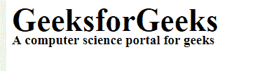
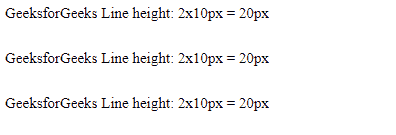
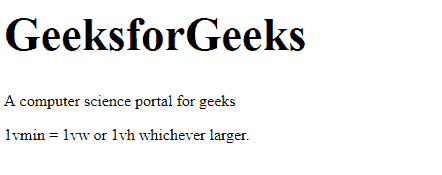

# CSS 单位

> 原文:[https://www.geeksforgeeks.org/css-units/](https://www.geeksforgeeks.org/css-units/)

CSS 有几个不同的**单位**来表示长度和度量。需要 CSS 单位来指定样式表中的度量，如*填充:“5px”*。CSS 中主要有两类单位。

*   绝对长度
*   相对长度

**绝对长度:**不适合在屏幕上使用，因为屏幕大小因页面使用的设备而异，建议用于打印布局和已知输出介质的地方。

**绝对长度单位:**

**厘米:厘米**

**语法:**

```css
   font-size: 0.5cm;
   line-height: 0.1cm;
```

**示例:**本示例通过以*厘米为单位指定长度单位来说明 CSS 单位。*

## 超文本标记语言

```css
<html>

<head>
    <title>CSS units</title>
    <style>
    .gfg {
        font-size: 1.2cm;
        font-weight: bold;
    }

    .geeks {
        font-size: 0.5cm;
        line-height: 0.1cm;
    }
    </style>
</head>

<body>
    <div class="gfg">GeeksforGeeks</div>
    <div class="geeks">A computer science portal for geeks</div>
</body>

</html>
```

**输出:**



**毫米:毫米**

**语法:**

```css
   font-size: 5mm;
   line-height: 1mm;
```

**示例:**本示例通过以*毫米*为单位指定长度单位来说明 CSS 单位

## 超文本标记语言

```css
<html>

<head>
    <title>CSS units</title>
    <style>
    .gfg {
        font-size: 12mm;
        font-weight: bold;
    }

    .geeks {
        font-size: 5mm;
        line-height: 1mm;
    }
    </style>
</head>

<body>
    <div class="gfg">GeeksforGeeks</div>
    <div class="geeks">A computer science portal for geeks</div>
</body>

</html>
```

**输出:**


**英寸**

**注:**英寸(1 英寸= 96px = 2.54cm 厘米)

**语法:**

```css
    font-size: 0.2in;
    line-height: 0.1in;
```

**示例:**本示例通过以英寸为单位指定长度单位来说明 CSS 单位。

## 超文本标记语言

```css
<html>

<head>
    <title>CSS units</title>
    <style>
    .gfg {
        font-size: .5in;
        font-weight: bold;
    }

    .geeks {
        font-size: .2in;
        line-height: .1in;
    }
    </style>
</head>

<body>
    <div class="gfg">GeeksforGeeks</div>
    <div class="geeks">A computer science portal for geeks</div>
</body>

</html>
```

**输出:**


**px:像素**

**注:**像素(1px = 1 英寸的 1/96)

**语法:**

```css
   font-size: 20px;
   line-height: 10px;
```

**示例:**本示例通过以像素为单位指定长度单位来说明 CSS 单位。

## 超文本标记语言

```css
<html>

<head>
    <title>CSS units</title>
    <style>
    .gfg {
        font-size: 40px;
        font-weight: bold;
    }

    .geeks {
        font-size: 17px;
        line-height: 5px;
    }
    </style>
</head>

<body>
    <div class="gfg">GeeksforGeeks</div>
    <div class="geeks">A computer science portal for geeks</div>
</body>

</html>
```

**输出:**


**pt:**T2】分

**注:**点(1pt = 1 in 的 1/72)

**语法:**

```css
    font-size: 16pt;
    line-height: 8pt;
```

**示例:**本示例通过以磅为单位指定长度单位来说明 CSS 单位。

## 超文本标记语言

```css
<html>

<head>
    <title>CSS units</title>
    <style>
    .gfg {
        font-size: 35pt;
        font-weight: bold;
    }

    .geeks {
        font-size: 15pt;
        line-height: 5pt;
    }
    </style>
</head>

<body>
    <div class="gfg">GeeksforGeeks</div>
    <div class="geeks">A computer science portal for geeks</div>
</body>

</html>
```

**输出:**


**pc: picas**

**注:** picas (1pc = 12 pt)

**语法:**

```css
      font-size: 1pc;
      line-height: 0.5pc;
```

**示例:**本示例通过在 *pc* 中指定长度单位来说明 CSS 单位。

## 超文本标记语言

```css
<html>

<head>
    <title>CSS units</title>
    <style>
    .gfg {
        font-size: 3pc;
        font-weight: bold;
    }

    .geeks {
        font-size: 1.3pc;
        line-height: .2pc;
    }
    </style>
</head>

<body>
    <div class="gfg">GeeksforGeeks</div>
    <div class="geeks">A computer science portal for geeks</div>
</body>

</html>
```

**输出:**


**相对长度:**适合在屏幕上使用，如果屏幕大小因设备而异，那么这些相对长度单位是完美的，因为它会随着不同的渲染介质而变化。

**相对长度单位:**

**em:** 相对于该元素的字体大小。

**注意:**这里的 2em 是指当前字体大小的 2 倍。

**语法:**

```css
    font-size: 10px;
    line-height: 2em;
```

**示例:**本示例通过在 *em* 中指定长度单位来说明 CSS 单位。

## 超文本标记语言

```css
<html>

<head>
    <title>relative unit</title>
    <style>
    p {
        font-size: 15px;
        line-height: 2em;
    }
    </style>
</head>

<body>

<p>GeeksforGeeks Line height: 2x10px = 20px</p>

<p>GeeksforGeeks Line height: 2x10px = 20px</p>

<p>GeeksforGeeks Line height: 2x10px = 20px</p>

</body>

</html>
```

**输出:**



**ex:** 相对于 X(轴)-当前字体的高度。

**语法:**

```css
font-size: 1ex;
```

**示例:**本示例通过在 *ex* 中指定长度单位来说明 CSS 单位。

## 超文本标记语言

```css
<html>

<head>
    <title>relative unit</title>
    <style>
    p {
        font-size: 40px;
    }

    span {
        font-size: 1ex;
    }
    </style>
</head>

<body>

<p>GeeksforGeeks:<span>A computer science
        portal for geeks</span></p>

</body>

</html>
```

**输出:**


**ch:** 相对于 *0* 的宽度。

**语法:**

```css
font-size: 2ch;
```

**示例:**本示例通过在 *ch* 中指定长度单位来说明 CSS 单位。

## 超文本标记语言

```css
<html>

<head>
    <title>ch unit in CSS</title>
    <style>
    body {
        font-size: 50px;
    }

    div {
        font-size: 1ch;
    }
    </style>
</head>

<body>

<p>GeeksforGeeks</p>

    <div>A computer science portal for geeks</div>
</body>

</html>
```

**输出:**


**rem:** 相对于浏览器基本字号。

**语法:**

```css
font-size: 3rem;
```

**示例:**本示例通过在 *rem* 中指定长度单位来说明 CSS 单位。

## 超文本标记语言

```css
<html>

<head>
    <title>ch unit in CSS</title>
    <style>
    body {
        font-size: 4rem;
    }

    div {
        font-size: 1.6rem;
    }
    </style>
</head>

<body>

<p>GeeksforGeeks</p>

    <div>A computer science portal for geeks</div>
</body>

</html>
```

**输出:**


**大众:**相对于视口宽度的 1%。

**语法:**

```css
font-size: 10vw;
```

**示例:**本示例通过在*大众*中指定长度单位来说明 CSS 单位。

## 超文本标记语言

```css
<html>

<head>
    <title>vw unit</title>
    <style>
    h1 {
        font-size: 4vw;
    }
    </style>
</head>

<body>
    <h1>GeeksforGeeks</h1>

<p>A computer science portal for geeks</p>

</body>

</html>
```

**输出:**


**vh:** 相对于视口高度的 1%。

**语法:**

```css
font-size: 10vh;
```

**示例:**本示例通过在 *vh* 中指定长度单位来说明 CSS 单位。

## 超文本标记语言

```css
<html>

<head>
    <style>
    h1 {
        font-size: 6vh;
    }
    </style>
</head>

<body>
    <h1>GeeksforGeeks</h1>

<p>A computer science portal for geeks</p>

</body>

</html>
```

**输出:**


**vmin:** 相对于视口较小尺寸的 1%。

**语法:**

```css
font-size: 10vmin;
```

**示例:**本示例通过在 *vmin* 中指定长度单位来说明 CSS 单位。

## 超文本标记语言

```css
<html>

<head>
    <title>vmin unit</title>
    <style>
    h1 {
        font-size: 8vmin;
    }
    </style>
</head>

<body>
    <h1>GeeksforGeeks</h1>

<p>A computer science portal for geeks</p>

<p>1vmin = 1vw or 1vh whichever is smaller.</p>

</body>

</html>
```

**输出:**



**vmax:** 相对于视口较大尺寸的 1%。

**语法:**

```css
font-size: 20vmax;
```

**示例:**本示例通过在 *vmax* 中指定长度单位来说明 CSS 单位。

## 超文本标记语言

```css
<html>

<head>
    <title>vmax unit</title>
    <style>
    h1 {
        font-size: 5vmax;
    }
    </style>
</head>

<body>
    <h1>GeeksforGeeks</h1>

<p>A computer science portal for geeks</p>

<p>1vmax = 1vw or 1vh whichever larger.</p>

</body>

</html>
```

**输出:**


**%:** %单位设置相对于当前字体大小的字体大小。

**语法:**

```css
font-size: 250%;
```

**示例:**本示例通过以百分比指定长度单位来说明 CSS 单位。

## 超文本标记语言

```css
<html>

<head>
    <title>CSS unit</title>
    <style>
    body {
        font-size: 250%;
    }

    div {
        font-size: 17px;
    }
    </style>
</head>

<body>

<p>GeeksforGeeks</p>

    <div>A computer science portal for geeks</div>
</body>

</html>
```

**输出:**


**支持的浏览器:**

*   谷歌 Chrome
*   微软公司出品的 web 浏览器
*   微软边缘
*   火狐浏览器
*   歌剧
*   旅行队