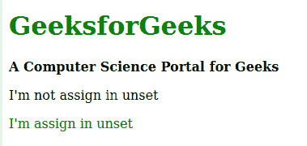

# CSS |取消设置关键字

> 原文:[https://www.geeksforgeeks.org/css-unset-keyword/](https://www.geeksforgeeks.org/css-unset-keyword/)

**CSS 未设置**关键字是 CSS 中的一个内置关键字。CSS unset 关键字是 CSS 中的一个内置关键字，用于将层叠样式取消设置到其父元素。它的行为类似于第一种情况下的 inherit 关键字，类似于第二种情况下的初始关键字
**语法:**

```css
property: unset;
```

以下示例说明了 CSS 中**取消设置**关键字:
**示例:**

## 超文本标记语言

```css
<!DOCTYPE html>
<html>
    <head>
        <title>CSS unset keyword</title>
        <style>

            /* Color for all the child in parent element */
            div {
                color: green;
            }

            /* Specific b and p element color */
            b, p {
                color: black;
            }

            /* Performing revert for child */
            .rvt {
                color: unset;
            }
        </style>
    </head>
    <body>

        <!-- Parent elements -->
        <div class="container">

            <!-- Child elements -->
            <h1>GeeksforGeeks</h1>
            <b>A Computer Science Portal for Geeks</b>

<p>I'm not assign in unset</p>

            <p class="rvt">I'm assign in unset</p>

        </div>
    </body>
</html>
```

**输出:**



**支持的浏览器:**CSS unset 关键字支持的浏览器如下:

*   Mozilla Firefox
*   互联网浏览器/微软边缘