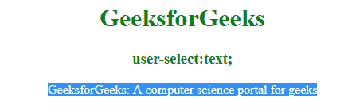

# CSS |用户选择属性

> 原文:[https://www.geeksforgeeks.org/css-user-select-property/](https://www.geeksforgeeks.org/css-user-select-property/)

此属性用于指定用户是否可以选择文本。
**注意:**双击某些文本将被选中/高亮显示，但该属性可用于防止这种情况。

**语法:**

```css
user-select: auto|none|text|all;
```

**默认值:自动**

**房产价值:**

**自动:**有默认值，即用户可以选择文本。
**语法:**

```css
user-select: auto;
```

**例:**

## 超文本标记语言

```css
<!DOCTYPE html>
<html>
    <head>
        <title>user-select property</title>
        <style>
            div {
                -webkit-user-select: auto;
                -moz-user-select: auto;
                -ms-user-select: auto;
                user-select: auto;
            }
            h1, h3 {
                color:green;
            }
            body {
                text-align:center;
            }
        </style>
    </head>
    <body>
        <h1>GeeksforGeeks</h1>
        <h3>user-select:auto;</h3>
        <div>
         GeeksforGeeks:
         A computer science portal for geeks
        </div>
    </body>
</html>                   
```

**输出:**


**无:**用于阻止用户选择文本，表示用户无法自行选择文本。
**语法:**

```css
user-select: none;
```

**例:**

## 超文本标记语言

```css
<!DOCTYPE html>
<html>
    <head>
        <title>user-select property</title>
        <style>
            div {
                -webkit-user-select: none;
                -moz-user-select: none;
                -ms-user-select: none;
                user-select: none;
            }
            h1, h3 {
                color:green;
            }
            body {
                text-align:center;
            }
        </style>
    </head>
    <body>
        <h1>GeeksforGeeks</h1>
        <h3>user-select:none;</h3>
        <div>
         GeeksforGeeks:
         A computer science portal for geeks
        </div>
    </body>
</html>
```

**输出:**


**文本:**该属性允许用户选择文本。它不提供阻止用户选择文本。
**语法:**

```css
user-select: text;
```

**例:**

## 超文本标记语言

```css
<!DOCTYPE html>
<html>
    <head>
        <title>user-select property</title>
        <style>
            div {
                -webkit-user-select: text;
                -moz-user-select: text;
                -ms-user-select: text;
                user-select: text;
            }
            h1, h3 {
                color:green;
            }
            body {
                text-align:center;
            }
        </style>
    </head>
    <body>
        <h1>GeeksforGeeks</h1>
        <h3>user-select:text;</h3>
        <div>
         GeeksforGeeks:
         A computer science portal for geeks
        </div>
    </body>
</html>
```

**输出:**


**all:** 用于鼠标一击选择文本，而不是双击。
**语法:**

```css
user-select: all;
```

**例:**

## 超文本标记语言

```css
<!DOCTYPE html>
<html>
    <head>
        <title>user-select property</title>
        <style>
            div {
                -webkit-user-select: all;
                -moz-user-select: all;
                -ms-user-select: all;
                user-select: all;
            }
            h1, h3 {
                color:green;
            }
            body {
                text-align:center;
            }
        </style>
    </head>
    <body>
        <h1>GeeksforGeeks</h1>
        <h3>user-select:text;</h3>
        <div>
         GeeksforGeeks:
         A computer science portal for geeks
       </div>
    </body>
</html>
```

**输出:**



**支持的浏览器:**用户选择属性支持的浏览器如下:

*   谷歌 Chrome
*   微软公司出品的 web 浏览器
*   火狐浏览器
*   歌剧
*   旅行队