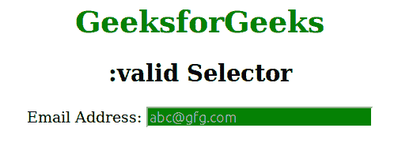

# CSS |:有效选择器

> 原文:[https://www.geeksforgeeks.org/css-valid-selector/](https://www.geeksforgeeks.org/css-valid-selector/)

:有效选择器用于选择具有给定值的表单元素，该值根据元素进行验证。

此选择器仅适用于具有某些限制的表单元素，如具有最小和最大属性的输入元素、具有合法电子邮件的电子邮件字段或具有数值的数字字段等。

**语法:**

```html
:valid {
    // CSS property
} 

```

**示例:**

```html
<!DOCTYPE html>
<html>
    <head>
        <title>valid selector</title>
        <style>
            h1 {
                color:green;
            }
            input:valid {
                background-color: green;
                color:white;
            }
            body {
                text-align:center;
            }
        </style>
    </head>
    <body>
        <h1>GeeksforGeeks</h1>
        <h2>:valid Selector</h2>
        Email Address: <input type="email" placeholder="abc@gfg.com">
    </body>
</html>                            
```

**输出:**


**支持的浏览器:***支持的浏览器:有效*选择器如下:

*   苹果 Safari 5.0
*   谷歌 Chrome 10.0
*   Firefox 4.0
*   opera10.0
*   Internet Explorer 10.0