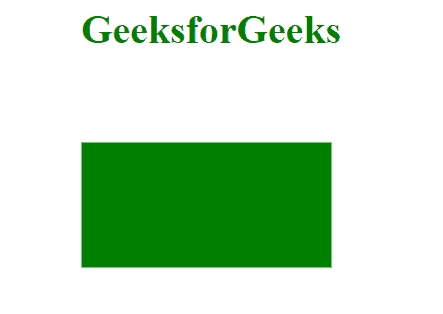
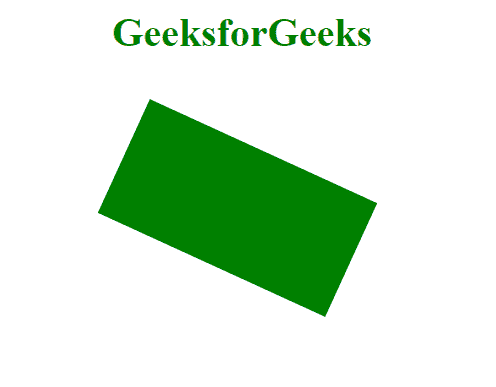
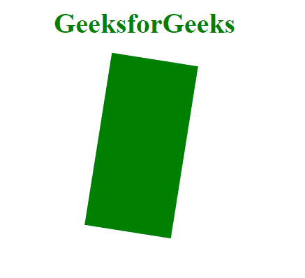

# CSS 值|角度

> 原文:[https://www.geeksforgeeks.org/css-value-angle/](https://www.geeksforgeeks.org/css-value-angle/)

CSS 上的**角度**代表某个角度值，可以用度、梯度、弧度或转角来表示。角度值可用于旋转、变换或渐变等。

**语法:**角度由一个数字后跟一个允许的单位组成。

```css
*property*: number unit;
```

**允许单位:**

*   **度:**代表角度，单位为度。一整圈是 360 度。例如:0 度，90 度。
*   **梯度:**代表梯度中的角度。一整圈就是 400 格勒。例如:0grad，38.8grad。
*   **rad:** 表示以弧度为单位的角度。一整圈是 2π弧度，接近 6.2832 弧度，1 弧度是 180/π度。例如:0 弧度，1.07 弧度。
*   **转弯:**代表转弯次数中的一个角度。一整圈等于 1 转。例如:0 转，1.2 转。

**示例 1:** 使用 deg 单位将元素旋转 90 度。

```css
<!DOCTYPE html>
<html>
<meta charset="utf-8">
<head>
  <title>CSS | value angle</title>
</head>
<style>
    div{
      transform: rotate(90deg); 
      }
</style>
<body>
    <h1 style="text-align: center; color: green;">GeeksforGeeks</h1>
    <div style="width: 100px; height: 200px;
         margin-left: 46vw; background: green;">
    </div>
</body>
</html>
```

**输出:**



**示例 2:** 使用 rad 单位旋转元素。

```css
<!DOCTYPE html>
<html>
<meta charset="utf-8">
<head>
  <title>CSS | value angle</title>
</head>
<style>
    div{
      transform: rotate(2rad); 
    }
</style>
<body>
    <h1 style="text-align: center; color: green;">GeeksforGeeks</h1>
    <div style="width: 100px; height: 200px; 
         margin-left: 46vw; background: green;">
    </div>
</body>
</html>
```

**输出:**



**示例 3:** 使用渐变单元旋转元素。

```css
<!DOCTYPE html>
<html>
<meta charset="utf-8">
<head>
  <title>CSS | value angle</title>
</head>
<style>
    div{
      transform: rotate(10grad); 
    }
</style>
<body>
    <h1 style="text-align: center; color: green;">
        GeeksforGeeks
    </h1>
    <div style="width: 100px; height: 200px;
         margin-left: 46vw; background: green;">
    </div>
</body>
</html>
```

**输出:**



**示例 4:** 使用旋转单元旋转元素。

```css
<!DOCTYPE html>
<html>
<meta charset="utf-8">
<head>
  <title>CSS | value angle</title>
</head>
<style>
    div{
      transform: rotate(1.25turn); 
    }
</style>
<body>
    <h1 style="text-align: center; color: green;">
           GeeksforGeeks</h1>
    <div style="width: 100px; height: 200px; 
         margin-left: 46vw; background: green;">
    </div>
</body>
</html>
```

**输出:**

