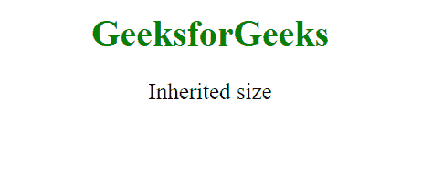
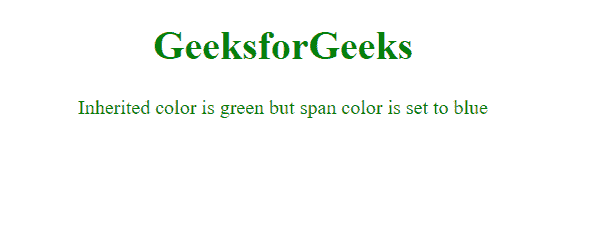

# CSS 值继承

> 原文:[https://www.geeksforgeeks.org/css-value-inherit/](https://www.geeksforgeeks.org/css-value-inherit/)

value inherit 关键字用于从元素的父元素属性值继承元素的属性。inherit 关键字可用于继承任何 CSS 属性和任何 HTML 元素。

继承始终来自文档树中的父元素，即使父元素不是包含块。

**语法:**

```css
*property_name*: inherit;
```

**示例 1:** 从父元素继承字体大小。

```css
<!DOCTYPE html>
<html>
<meta charset="utf-8">

<head>
    <style>
        span {
            font-size: 10px;
        }

        .gfg {
            font-size: inherit;
        }
    </style>
</head>

<body>
    <h1 style="text-align: center;
               color: green;">
        GeeksforGeeks
    </h1>
    <div style="text-align: center; font-size: 20px;">
        <span class="gfg">Inherited size</span>
    </div>
</body>

</html>
```

**输出:**



**示例 2:** 从父元素继承颜色。

```css
<!DOCTYPE html>
<html>
<meta charset="utf-8">

<head>
    <style>
        span {
            color: blue;
        }

        .gfg {
            color: inherit;
        }
    </style>
</head>

<body>
    <h1 style="text-align:center; color:green;">
        GeeksforGeeks
    </h1>

    <div style="text-align: center; color: green">
        <span class="gfg">
            Inherited color is green but 
            span color is set to blue
        </span>
    </div>
</body>

</html>
```

**输出:**



**支持的浏览器:**

*   铬
*   旅行队
*   边缘
*   火狐浏览器
*   歌剧