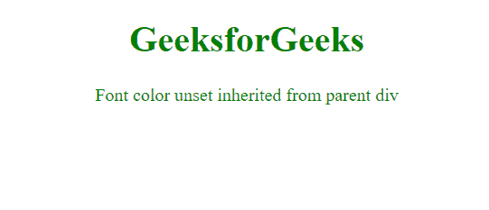

# CSS 值|初始值

> 原文:[https://www.geeksforgeeks.org/css-value-initial/](https://www.geeksforgeeks.org/css-value-initial/)

**初始**值关键字用于将元素的 CSS 属性设置为默认值。

初始关键字可以用于任何 CSS 属性和任何 HTML 元素。

**语法:**

```html
*property_name*: initial;
```

**示例 1:** 设置字体大小

```html
<!DOCTYPE html>
<html>
<meta charset="utf-8">
<head>
  <title>CSS | value unset</title>
</head>
<style>

span {
    color: blue;
}
.gfg {
    color: unset;
}
</style>
<body>
    <h1 style="text-align: center; color: green;">
         GeeksforGeeks
   </h1>
    <div style="text-align: center;">
     <span class="gfg">Font color unset</span>
    </div>
</body>
</html>
```

**输出:**


**示例 2:** 将字体颜色取消设置为等效的父元素值。

```html
<!DOCTYPE html>
<html>
<meta charset="utf-8">
<head>
  <title>CSS | value unset</title>
</head>
<style>

span {
    color: blue;
}
.gfg {
    color: unset;
}
</style>
<body>
    <h1 style="text-align: center; color: green;">
         GeeksforGeeks
   </h1>
    <div style="text-align: center; color: green;">
     <span class="gfg">
  Font color unset inherited from parent div
    </span>
    </div>
</body>
</html>
```

**输出:**



**支持的浏览器:**

*   铬
*   旅行队
*   边缘
*   火狐浏览器
*   歌剧