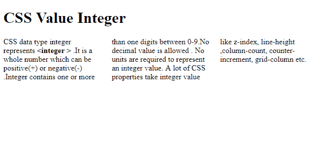
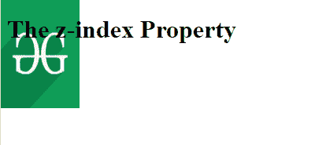

# CSS |数值整数

> 原文:[https://www.geeksforgeeks.org/css-value-integer/](https://www.geeksforgeeks.org/css-value-integer/)

CSS 数据类型整数代表 **<整数>** 。它是一个整数，可以是正(+)或负(-)。整数包含 0-9 之间的一个或多个数字。不允许使用十进制值。
表示整数值不需要单位。很多 CSS 属性都取整数值，比如 z 索引、行高、列数、计数器增量、网格列等等。
**有效整数**

```
1, 29, 047, +67, +9086, -9821, -32
```

**无效整数**

```
1.08, -9.86, 9.9t, 4/3
```

**例 1:**

## 超文本标记语言

```
<!DOCTYPE html>
<html>
    <head>
        <style>
            .gfg {
                column-count: 3;
            }
        </style>
    </head>
    <body>
        <h1>CSS Value Integer</h1>

        <div class="gfg">
            CSS data type integer represents
          <strong><integer > </strong>.
          It is a whole number which can be positive(+)
          or negative(-) .Integer contains one or more
          than one digits between 0-9.No decimal value
          is allowed . No units
            are required to represent an integer value.
          A lot of CSS properties take integer value
          like z-index, line-height, column-count,
          counter-increment, grid-column etc.
        </div>
    </body>
</html>
```

**输出**T2】



在本例中，列计数接受整数输入。
**例 2:**

## 超文本标记语言

```
<!DOCTYPE html>
<html>
    <head>
        <style>
            img {
                position: absolute;
                left: 0px;
                top: 0px;
                z-index: -1;
            }
        </style>
    </head>
    <body>
        <h1>The z-index Property</h1>

        
    </body>
</html>
```

**输出**T2】



在这个例子中，z-index 接受一个整数作为输入。因为图像的 z 索引为-1，所以它将被放在标题后面。