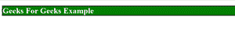

# CSS 值解析

> 原文:[https://www.geeksforgeeks.org/css-value-resolution/](https://www.geeksforgeeks.org/css-value-resolution/)

CSS 解析是数据类型之一。顾名思义，它用于指定分辨率，即输出设备上的像素密度。分辨率通常在编写媒体查询时使用。用户可以在编写媒体查询时使用最大和最小前缀的分辨率。

**什么是媒体查询:**媒体查询用于 Responsive web 开发，可以根据输出设备的各种特性来改变屏幕样式。它在 CSS3 中定义。

**分辨率数据类型特征:**

*   它总是一个正值。
*   它总是有一个单位:dpi，dpcm，dppx，x。
*   正值和单位之间不应有任何空格。

**单位:**有 3 个主要单位用于指定分辨率-

*   dpi:代表每英寸点数。
*   dpcm:代表每厘米点数。
*   dppx 或 x:每 px 单位的点数。

**分辨率示例:**

## 超文本标记语言

```html
<!DOCTYPE html>
<html>

<head>
    <style>
        h1 {
            border: 2px solid #000000;
        }

        /* Exact resolution */
        @media (min-resolution: 10dpi) {
            h1 {
                color: white;
            }
        }

        /* Exact resolution */
        @media (max-resolution: 500dpi) {
            h1 {
                background: green;
            }
        }
    </style>
</head>

<body>
    <h1>Geeks For Geeks Example</h1>
</body>

</html>
```

**输出:**



输出

如上例所示:

*   最小分辨率设置为 10dpi，因此在分辨率大于 10dpi 的设备上**颜色:白色**样式将应用于< h1 >标签
*   最大分辨率设置为 500dpi，因此在分辨率低于 500dpi 的设备上**背景:绿色**样式将应用于< h1 >标签