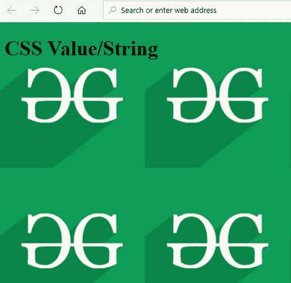

# CSS 值字符串

> 原文:[https://www.geeksforgeeks.org/css-value-string/](https://www.geeksforgeeks.org/css-value-string/)

CSS 中的字符串是分配给属性的文本值。字符串是用单引号或双引号括起来的字符序列。

```
Example:
'GeeksForGeeks' is a String
"GeeksForGeeks" is a String

```

字符串内的引号是不允许的，需要用像“这是一个(双引号)”这样的\来转义。

除了用双引号或单引号括起来的 CSS 关键字之外的所有文本值都被视为 CSS 中的字符串。

**例如:**

CSS 中的内容属性接受一个字符串(要插入的内容)作为值。

```
<!DOCTYPE html>
<html>
<head>
<style>
    #insert:after{
        content: "Welcome to GeeksForGeeks";
    }
</style>
</head>
<body>
<h1>
    CSS Value/ String
</h1>
<div id="insert">
</div>
</body>
</html>
```

**输出**:


另一个例子是分配背景图像。背景图像的 URL 将包含在双引号中，这表示背景图像属性采用字符串值

```
<!DOCTYPE html>
<html>
<head>
<style>
body  {
  background-image: url("geeksforgeeks.png");
  background-color: #cccccc;
}
</style>
</head>
<body>
<h1>CSS Value/String</h1>
</body>
</html>
```

**输出**:

