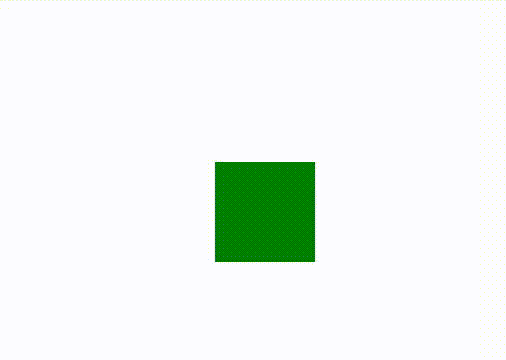

# CSS 值时间

> 原文:[https://www.geeksforgeeks.org/css-value-time/](https://www.geeksforgeeks.org/css-value-time/)

CSS 值时间， **<时间>** ，代表以秒或毫秒表示的时间值。它用于动画、过渡和相关属性。

**语法:**

> <number>单位</number>

**属性值:**

*   **<数字> :** 它代表我们想要的时间量或时长。前面可以有一个单独的 **+** 或**–**标志。
*   **单位:**是表象。可以是 **s** 、**女士**

**例 1:**

```css
<!DOCTYPE html>
<html>
<head>
<style> 
div {
  width: 100px;
  height: 100px;
  background: green;
  position: relative;
  animation: mymove infinite;
  animation-duration: 3s;/*CSS | Time */
}

@keyframes mymove {
  from {top: 0px;}
  to {top: 200px;}
}
</style>
</head>
<body>
<center><div></div></center>
</body>
</html>
```

**输出:**


**例 2**

```css
<!DOCTYPE html>
<html>
<head>
<style> 
div {
  width: 100px;
  height: 20px;
  background: green;
  transition: width 2s, height 4s;/*CSS | Time*/
}

div:hover {
  width: 300px;
  height: 300px;
}
</style>
</head>
<body>
<div><p style="color:white">GeeksforGeeks</p></div>
</body>
</html>
```

**输出:**
