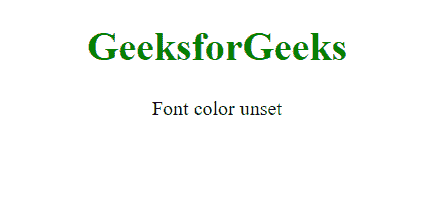
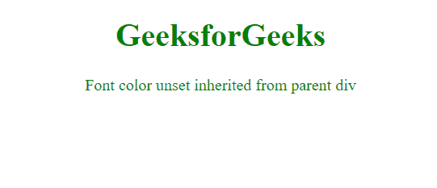

# CSS 值|取消设置

> 原文:[https://www.geeksforgeeks.org/css-value-unset/](https://www.geeksforgeeks.org/css-value-unset/)

要取消设置元素的值，使用**取消设置**关键字。

**unset** CSS 关键字将元素的属性重置为其继承值(如果该属性从其父元素自然继承)，或者重置为其初始值(如果它不继承)。换句话说，在第一种情况下，如果属性被继承，它的行为类似于 inherit 关键字；在第二种情况下，如果属性没有被继承，它的行为类似于 initial 关键字。

**语法:**

```
*property_name*: unset;
```

**示例 1:** 将元素的字体颜色取消设置为初始默认值。

```
<!DOCTYPE html>
<html>
<meta charset="utf-8">
<head>
  <title>CSS | value unset</title>
</head>
<style>

span {
    color: blue;
}
.gfg {
    color: unset;
}
</style>
<body>
    <h1 style="text-align: center; color: green;">
         GeeksforGeeks
    </h1>
    <div style="text-align: center;">
     <span class="gfg">Font color unset</span>
    </div>
</body>
</html>
```

**输出:**



**示例 2:** 将字体颜色取消设置为等效的父元素值。

```
<!DOCTYPE html>
<html>
<meta charset="utf-8">
<head>
  <title>CSS | value unset</title>
</head>
<style>

span {
    color: blue;
}
.gfg {
    color: unset;
}
</style>
<body>
    <h1 style="text-align: center; color: green;">
         GeeksforGeeks
    </h1>
    <div style="text-align: center; color: green;">
     <span class="gfg">
         Font color unset inherited from parent div
     </span>
    </div>
</body>
</html>
```

**输出:**



**支持的浏览器:**

*   铬
*   旅行队
*   边缘
*   火狐浏览器
*   歌剧