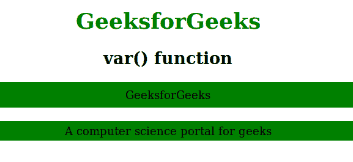

# CSS | var()函数

> 原文:[https://www.geeksforgeeks.org/css-var-function/](https://www.geeksforgeeks.org/css-var-function/)

CSS 中的 var()函数用于插入自定义属性的值。

**语法:**

```html
var( custom_property, value )
```

**参数:**该功能接受两个参数，如下所示:

*   **custom_property:** 必选参数。自定义属性的名称必须以两个破折号(–)开头。
*   **值:**为可选参数。如果自定义属性无效，则使用它。

下面的程序说明了 CSS 中的 var()函数:

**程序:**

```html
<!-- HTML code to describes var() function in CSS -->
<!DOCTYPE html>
<html>
    <head>
        <title>var() function</title>
        <style>
            :root {
                --main-bg-color: Green; 
            }

            /* Use of var() function */
            .gfg1 {
                background-color: var(--main-bg-color);
                padding:10px;
            }
            .gfg2 {
                background-color: var(--main-bg-color);
                padding: 5px;
            }
            h1 {
                color:green;
            }
            body {
                text-align:center;
            }
        </style>
    </head>
    <body>
        <h1>GeeksforGeeks</h1>
        <h2>var() function</h2>
        <div class = "gfg1">GeeksforGeeks</div><br>
        <div class = "gfg2">A computer science portal for geeks</div>
    </body>
</html>                    
```

**输出:**


**支持的浏览器:**var()函数支持的浏览器如下:

*   谷歌 Chrome 49.0
*   Edge 15.0
*   Firefox 31.0
*   Safari 9.1
*   Opera 36.0