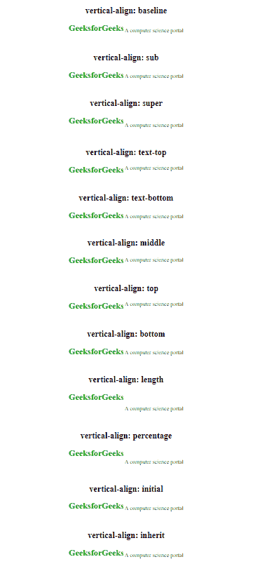

# CSS |垂直对齐属性

> 原文:[https://www.geeksforgeeks.org/css-vertical-align-property/](https://www.geeksforgeeks.org/css-vertical-align-property/)

CSS 中的垂直对齐属性用于指定表格框或内联元素的垂直对齐方式。

**语法:**

```
vertical-align: baseline|length|sub|super|top|text-top|middle|bottom
|text-bottom|initial|inherit;

```

**注:**

*   此属性主要用于将图像与其对应的文本对齐。
*   这个属性也可以用来对齐表格中的单元格。
*   垂直对齐属性不能用于像 p、ol、ul、h1、div 等块级元素的对齐。

**属性值:**

*   **基线:**它将元素基线与父元素的基线相对应。这可能因浏览器而异。这是默认值。
*   **sub:** 它将元素基线与其父元素的下标基线对齐。
*   **super:** 它将元素基线与其父元素的上标基线相对应。
*   **文本顶部:**它将元素顶部与父字体的顶部对齐。
*   **文本-底部:**将元素的底部与父字体的底部对齐。
*   **中间:**将元素的中间与父元素的中间对齐。
*   **顶部:**将元素的顶部与其所在线上最高元素的顶部对齐。
*   **底部:**将元素的底部与其直线上最短元素的顶部对齐。
*   **长度:**将元素的基线与其父元素基线上方的给定长度对齐。允许负值。
*   **百分比:**将元素的基线与其父元素基线上方的给定百分比相对应，该值为行高属性的百分比。
*   **初始值:**将该值初始化为默认值。
*   **继承:**从父元素继承值。

**示例:**本示例解释了垂直对齐属性的所有值。

```
<!DOCTYPE html>
<html>

<head>
    <title>
        CSS vertical-align Property
    </title>

    <style>
        .img1 {
            vertical-align: baseline;
        }
        .img2 {
            vertical-align: sub;
        }
        .img3 {
            vertical-align: super;
        }
        .img4 {
            vertical-align: text-top;
        }
        .img5 {
            vertical-align: text-bottom;
        }
        .img6 {
            vertical-align: middle;
        }
        .img7 {
            vertical-align: top;
        }
        .img8 {
            vertical-align: bottom;
        }
        .img9 {
            vertical-align: 25px;
        }
        img.img10 {
            vertical-align: 100%;
        }
        .img11 {
            vertical-align: baseline;
        }
        .img12 {
            vertical-align: inherit;
        }
    </style>
</head>

<body>
    <h2>vertical-align: baseline</h2>
    <p>
        
        A computer science portal
    </p><br>

    <h2>vertical-align: sub</h2> 
    <p>
        
        A computer science portal
    </p><br>

    <h2>vertical-align: super</h2>
    <p>
        
        A computer science portal
    </p><br>

    <h2>vertical-align: text-top</h2>
    <p>
        
        A computer science portal
    </p><br>

    <h2>vertical-align: text-bottom</h2> 
    <p>
        
        A computer science portal
    </p><br>

    <h2>vertical-align: middle</h2>
    <p>
        
        A computer science portal
    </p><br>

    <h2>vertical-align: top</h2>
    <p>
        
        A computer science portal
    </p><br>

    <h2>vertical-align: bottom</h2>
    <p>
        
        A computer science portal
    </p><br>

    <h2>vertical-align: length</h2>
    <p>
        
        A computer science portal
    </p><br>

    <h2>vertical-align: percentage</h2>
    <p>
        
        A computer science portal
    </p><br>

    <h2>vertical-align: initial</h2>
    <p>
        
        A computer science portal
    </p><br>

    <h2>vertical-align: inherit</h2>
    <p>
        
        A computer science portal
    </p>
    </body>
</html>                    
```

**输出:**


**支持的浏览器:***垂直对齐属性*支持的浏览器如下:

*   Chrome 1.0
*   Edge 4.0
*   Firefox 1.0
*   Safari 1.0
*   Opera 4.0