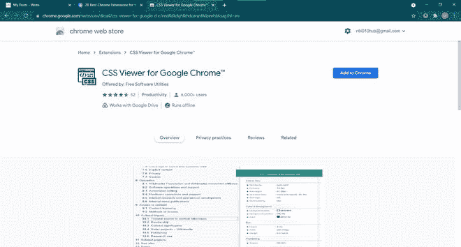
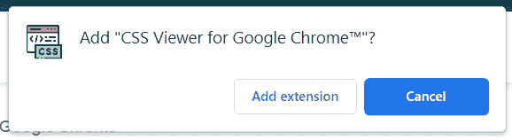
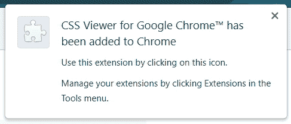
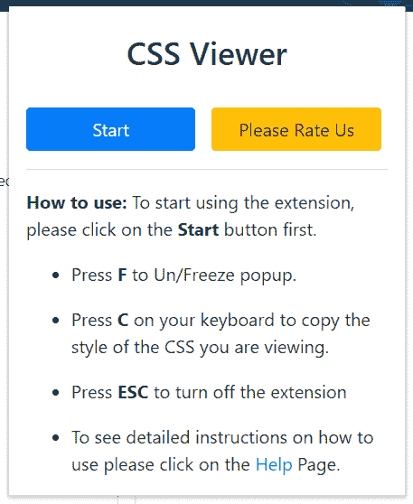
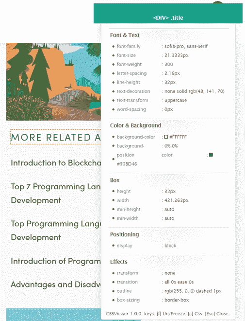
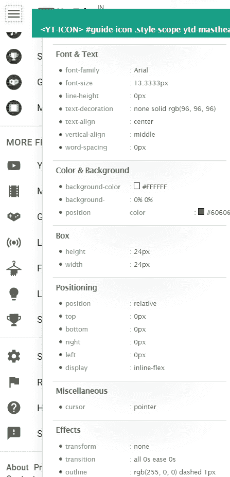
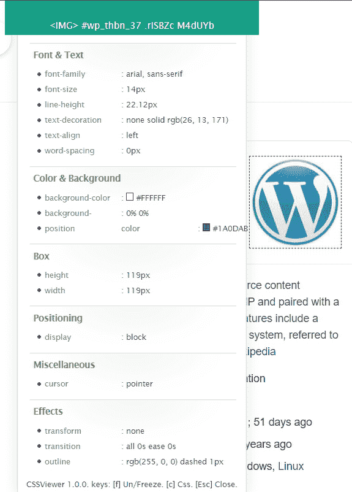
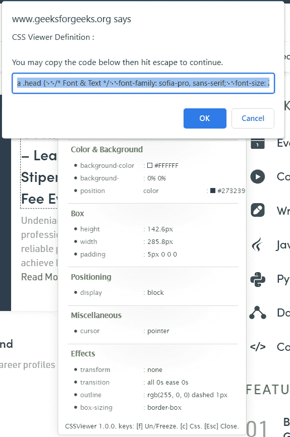
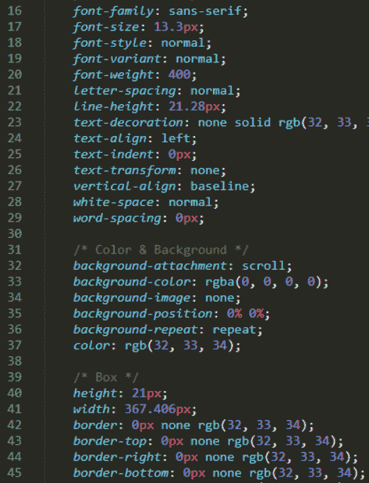

# 网页开发人员 CSS 查看器 Chrome 扩展

> 原文:[https://www . geesforgeks . org/CSS-viewer-chrome-extension-for-web-developers/](https://www.geeksforgeeks.org/css-viewer-chrome-extension-for-web-developers/)

CSS 查看器扩展是一个非常聪明和有用的扩展，它使识别任何地方的 CSS 属性成为他的鼠标。它既省时又非常快，还使识别 CSS 变得容易。它允许用户点击网页上的任何图像、按钮、文本等，我们可以立即看到所使用的 CSS 代码。它可以轻松地为网站上的特定元素整理 CSS 代码。会出现一个小的弹出窗口，向您显示组成您所指向的元素的 CSS 数据，您所要做的就是将鼠标悬停在您想要知道其 CSS 属性的图像/文本/元素上。

**特征:**

*   快速有效。
*   易于安装。
*   省时。
*   瞬间看到 CSS 代码。

**插件的优势:**

*   插件或插件提供快速访问。
*   是跨平台和适应任何浏览器。
*   人们可以整合那些看起来不可接受的对象。
*   将云存储和系统合并到一个工作空间中。

**插件的缺点:**

*   需要不断更新，这是非常忙乱的。
*   一个特定的浏览器需要它自己改编的程序版本。
*   它们要求能够读取甚至更改用户访问的网页上的所有内容，这在某些情况下会导致数据泄露、获取密码、跟踪浏览等事故。

### 快捷方式:

*   按 **F** 解冻/冻结弹出。
*   按键盘上的 **C** 复制正在查看的 CSS 样式。
*   按 **ESC** 关闭分机。

**安装:**

安装 CSS 查看器是一个非常简单和容易的过程。

**步骤 1:** 在 Chrome 网络商店或 Firefox 加载项中访问 CSS 查看器。

**第二步:**现在点击添加到 Chrome 或添加到 Firefox 按钮，具体取决于你使用的浏览器。

瞧，你安装了你的 CSS 浏览器。成功安装后，您可以看到右上角的扩展将被添加到您的浏览器中。

用法:

使用 CSS Viewer 非常简单，第一个需要通过点击它的图标，然后点击开始按钮来启动这个插件。

然后只需将鼠标悬停在图像/文本上即可查看 CSS 属性。

#### 示例 1 文本的 CSS 属性:

假设我们想知道“GBLOG 中更多相关文章”的 CSS，那么只需将鼠标悬停在上面即可。

#### 结果:

将出现一个弹出窗口，显示其 CSS 属性。在弹出窗口中，我们可以看到字体大小、高度、颜色背景和其他 CSS 属性。

#### 示例 2 汉堡图标的 CSS 属性:

让我们再举一个例子，只需将鼠标悬停在 CSS 属性上即可。

#### 示例 3 图像的 CSS 属性:

在下面给出的截图中，CSS 查看器扩展向我们显示了图像的 CSS 属性，如 Box 高度和宽度以及其他 CSS 属性。

#### 示例 4 入门按钮的 CSS 属性:

要查看“入门”的 CSS 元素，请将光标移动到所选内容，并查看“入门”按钮的 CSS 属性。

#### 示例 5 复制 CSS 代码:

我们也可以通过简单地使用快捷键来复制 CSS 代码。

 

总之，CSS Viewer 是一个非常有用和智能的插件，网络开发人员可以使用它，因为它节省了大量时间。它不仅速度快，而且显示了图像/文本的所有属性。但是请记住，某些扩展需要许可，这有时会导致数据泄露和软件攻击等事故。