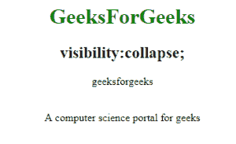

# CSS |可见性属性

> 原文:[https://www.geeksforgeeks.org/css-visibility-property/](https://www.geeksforgeeks.org/css-visibility-property/)

此属性用于指定一个元素在 web 文档中是否可见，但隐藏的元素会占用 web 文档中的空间。使用 display 属性可以移除或显示属性，以便从浏览器中隐藏和删除元素。

**语法:**

```css
visibility: visible|hidden|collapse|initial|inherit;
```

**属性值:**

*   **visible:** It is the default value. The element is show or visible normally in the web document.

    **语法:**

    ```css
    visibility:hidden;
    ```

    **示例:**

    ```css
    <!DOCTYPE html>
    <html>
        <head>
            <title>
                CSS | visibility Property
            </title>
            <style>
                h1 {
                    color:green;
                }
                .geeks {
                    visibility: visible;
                }
                body {
                    text-align:center;
                }
            </style>
        </head>
        <body>
            <h1>GeeksforGeeks</h1>
            <h2>visibility:visible;</h2>
            <p class="geeks">
             A computer science portal for geeks
            </p>
        </body>
    </html>                                
    ```

    **输出:**
    

*   **hidden:** This property hide the element from the page but takes up space in the document.

    **语法:**

    ```css
    visibility:hidden;
    ```

    **示例:**

    ```css
    <!DOCTYPE html>
    <html>
        <head>
            <title>
                CSS | visibility Property
            </title>
            <style>
                h1 {
                    color:green;
                }
                .geeks {
                    visibility: hidden;
                }
                body {
                    text-align:center;
                }
            </style>
        </head>
        <body>
            <h1>GeeksforGeeks</h1>
            <h2>visibility:hidden;</h2>
            <p class="geeks">
             A computer science portal for geeks
            </p>
        </body>
    </html>                    
    ```

    **输出:**
    

*   **collapse:** This property only used for the table elements. It is used to remove the rows and column from the table but it does not affect the layout of the Table. But their space is available for other content.
    **Note**:This property is not used for other elements except table elements.

    **语法:**

    ```css
    visibility:collapse;
    ```

    **示例:**

    ```css
    <!DOCTYPE html>
    <html>
        <head>
            <title>
                CSS | visibility Property
            </title>
            <style>
                table.geeks {
                    visibility: collapse
                }
                table, th, td {
                border:1px solid red;
                p {
                color:green;
                font-size:25px;
                }
            </style>
        </head>
        <body>
            <center>
            <h1 style="color:green;">GeeksForGeeks</h1>
            <h2>visibility:collapse;</h2>
            <p>geeksforgeeks</p>
            <table style="border:1px solid red;" class="geeks">
                <tr>
                    <th>geeks</th>
                    <th>for</th>
                    <th>geeks</th>
                </tr>
            </table>
            <p>A computer science portal for geeks</p>
            </center>
        </body>
    </html>                    
    ```

    **输出:**
    

**支持的浏览器:**可见性属性支持的浏览器如下:

*   谷歌 Chrome
*   微软公司出品的 web 浏览器
*   火狐浏览器
*   歌剧
*   旅行队