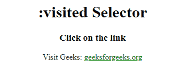

# CSS |:已访问选择器

> 原文:[https://www.geeksforgeeks.org/css-visited-selector/](https://www.geeksforgeeks.org/css-visited-selector/)

CSS 中的:被访问的选择器用于选择被访问的链接。例如，访问网站上的某个链接并再次看到它，然后它会发现该链接的颜色发生了变化。这种颜色的变化是由:访问选择器完成的。
被访问选择器的允许 CSS 属性如下:

*   颜色
*   边框颜色
*   背景色
*   轮廓颜色
*   列规则颜色
*   填充颜色和描边

**语法:**

```
:visited {
    // CSS Properties
}
```

**例:**

## 超文本标记语言

```
<!-- HTML code to illustrate :visited selectors -->
<!DOCTYPE html>
<html>
    <head>
        <title>:visited selector</title>
        <style>

            /* visited CSS property */
            a:visited {
                color: green;
            }
        </style>
    </head>

    <body style = "text-align:center">

        <h1>
            :visited Selector
        </h1>

        <h3>
            Click on the link
        </h3>

<p>
            Visit Geeks:
            <a href = "https://www.geeksforgeeks.org/"
            target = "_blank">geeksforgeeks.org</a>
        </p>

    </body>
</html>                   
```

**输出:**



**支持的浏览器:**

*   谷歌 Chrome
*   微软边缘
*   火狐浏览器
*   歌剧
*   狩猎