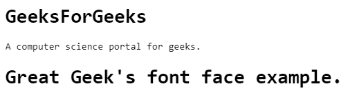
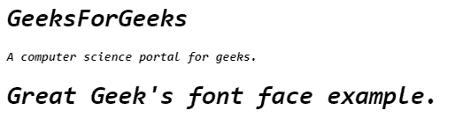

# CSS |网页字体

> 原文:[https://www.geeksforgeeks.org/css-web-fonts/](https://www.geeksforgeeks.org/css-web-fonts/)

Web 字体用于允许使用 CSS 中的字体，这些字体没有安装在本地系统上。选择未安装的字体后，只需将字体文件包含在网络服务器上，它将在需要时自动下载。

**语法:**

```html
@font-face {
    font details
}

```

**字体格式的类型:**字体格式有很多种，列举如下:

*   **TrueType 字体(TTF):** 无论是使用微软操作系统还是 Mac 操作系统，最常用的字体格式都是 TrueType。这是微软和苹果在 20 世纪 80 年代末开发的字体标准。TrueType 字体将每个字形描述为一组路径。路径是指使用点和特定数学指定的闭合曲线。例如，小写的“I”有两条路径，一条用于点，一条用于点的其余部分。像素用于填充路径以创建最终的字母形式。TrueType 字体格式的优点是字形是可缩放的，这意味着它可以设置为任何比例和任何磅值。
*   **OpenType 字体(OTF):** OpenType 是一种建立在 TrueType 上的字体格式。OpenType 字体格式是由微软和 Adobe 开发的，但却是微软的注册商标。OpenType 字体中的布局功能由脚本和语言组织，这允许单个字体在同一脚本中支持多个书写系统。OpenType 字体格式解决了更好地保护字体数据、更广泛的多平台支持等目标。
*   **Web 开放字体格式(WOFF):** WOFF 是 Mozilla 与 Type Supply、LettError 和其他组织合作于 2009 年开发的网页中使用的字体格式。WOFF 基本上是一个带有压缩和附加元数据的开放类型或真实类型。WOFF 的目标是支持在带宽受限的网络上从服务器到客户端的字体分发。WOFF 有两个版本，分别是 WOFF 和 WOFF2，它们在使用的压缩算法方面有很大的不同。它们分别由“woff”和“woff2”格式描述符描述。
*   **SVG 字体/形状:** SVG 代表可缩放矢量图形。当 SVG 第一次被指定时，大多数网络浏览器并不完全支持网络字体。但是为了正确呈现文本，后来在 SVG 中加入了字体描述技术来提供这种能力。它提供了在渲染时将字形信息嵌入到 SVG 中的方法。
*   **嵌入式 OpenType 字体(EOT):** 嵌入式 OpenType 文件格式由微软开发。EOT 字体是 OpenType 字体的紧凑形式，用作网页上的嵌入字体。它的设计目的是使 TrueType 和 OpenType 字体能够链接到网页进行下载，从而按照用户的要求使用字体呈现网页。

**字体描述符:**描述符可以在@字体规则中定义。我们现在将解释不同类型的字体描述符。

*   **字体系列:**用于定义字体的名称。网络字体必须运行。
*   **src:** 用来定义我们从中获取字体的 URL。与字体系列一样，src 也是必需的。除了这两个字段，其余的描述符都是可选的。
*   **字体-拉伸:**用于查找，字体应该如何拉伸。Normal 是默认情况下取的值。不同的字体拉伸值有正常、压缩、半压缩、超压缩、超压缩、扩展、半扩展、超扩展和最后超扩展。
*   **字体风格:**用于定义不同风格的字体。可以设置的不同样式是倾斜的，默认样式是正常的。
*   **字体粗细:**字体的粗细可以用这个描述符来定义。字体粗细默认值为“正常”。大胆的不同值是正常的，大胆的，我们也可以给出 100-900 范围内的数值，增量为 100。

**示例 1:** 这个示例说明了网络字体的使用。

```html
<!DOCTYPE html>
<html>

<head>
    <style> 
        @font-face{
            font-family: monospace;
            src:url(sansation_light.woff);
        }

        /* Sets  font family to monospace */
        * {
        font-family: monospace; 
        }
    </style>
</head>

<body>
    <div>
        <h1>GeeksForGeeks</h1>

        <p>A computer science portal for geeks.</p>
    </div>

    <h1>Great Geek's font face example.</h1>
</body>

</html>                    
```

**输出:**


**示例 2:** 这个示例说明了网络字体的使用。

```html
<!DOCTYPE html>
<html>

<head>
    <style> 
        @font-face{

            /* Set font family to monospace */
            font-family:monospace; 
            src:url(sansation_light.woff);
        }

        * {
            font-family:monospace;

            /** font style to italic */
            font-style:italic;
            font-weight:bold; 
        }
    </style>
</head>

<body>
    <div>
        <h1>GeeksForGeeks</h1>
        <p>A computer science portal for geeks.</p>
    </div>

    <h1>Great Geek's font face example.</h1>
</body>

</html>                    
```

**输出:**
