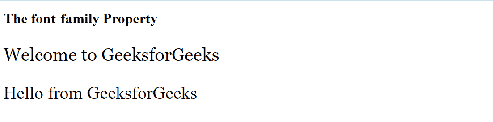
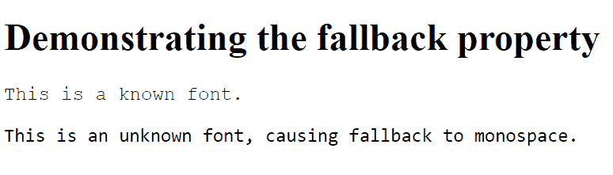
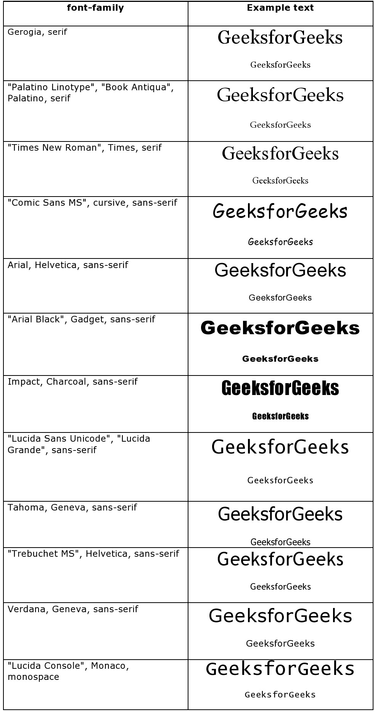

# CSS 网页安全字体

> 原文:[https://www.geeksforgeeks.org/css-web-safe-fonts/](https://www.geeksforgeeks.org/css-web-safe-fonts/)

CSS 中有各种各样的字体，人们可以在样式表中使用任何类型的字体。但是，用户的浏览器或操作系统可能不支持所有字体。为了克服这个问题，使用了带有网络安全字体的后备系统来确保最大的兼容性。

我们为“字体系列”属性指定了几个字体名称。我们从指定首先需要的字体开始，以通用字体系列结束。因此，第一种字体出现了不兼容性，它不断尝试下一种可以显示的字体，最终以一种可以在大多数浏览器中可靠显示的通用字体结束。

**语法:**

```css
CSS element {
    font-family: font details
}

```

**示例 1:** 在此示例中，显示了 web 安全字体的使用。

## 超文本标记语言

```css
<!DOCTYPE html>
<html>

<head>
    <style>
        p.welcome {
            font-family: Georgia, serif;
        }

        p.hello {
            font-family: Arial, Helvetica, sans-serif;
        }
    </style>
</head>

<body>
    <h1>The font-family Property</h1>
    <p class="welcome">
        Welcome to GeeksforGeeks
    </p>

    <p class="hello">
        Hello from GeeksforGeeks
    </p>
</body>

</html>
```

#### **输出:**



**示例 2:** 在此示例中，演示了回退机制。

## 超文本标记语言

```css
<!DOCTYPE html>
<html>

<head>
    <style>
        p.known-font {
            font-family: Courier, monospace;
            font-size: 16px;
        }

        p.unknown-font {

            /* Intentionally specifying 
                an unknown font */
            font-family: "Unknown Font", monospace;
            font-size: 16px;
        }
    </style>
</head>

<body>
    <h1>Demonstrating the fallback property</h1>

    <p class="known-font">
        This is a known font.
    </p>

    <p class="unknown-font">
        This is an unknown font,
        causing fallback to monospace.
    </p>
</body>

</html>
```

#### **输出:**



**注意:**大多数字体系列没有明显的变化，因此可能无法区分字体。例如，即使**时代新罗马**和**时代**看起来完全相同，但在更大的字体大小下可以看到差异，并且它们可以忽略不计。此外，不能保证所有浏览器都支持这两种字体。

在我们的网络项目中有更多的字体组合可以使用。以下是一些常用的字体组合:

