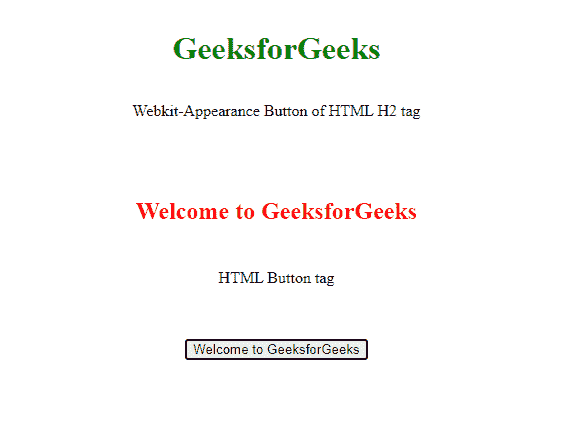
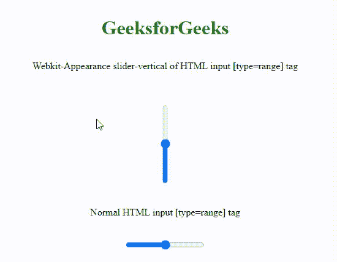

# CSS-web kit-外观

> 原文:[https://www.geeksforgeeks.org/css-webkit-appearance/](https://www.geeksforgeeks.org/css-webkit-appearance/)

CSS 中的 **-webkit-appearance** 属性被基于 webkit 的浏览器如 Safari 所使用。注意火狐和 Edge 也支持**-WebKit-外观**，出于某些原因兼容。虽然，**-WebKit-外观**属性得到了一些现代浏览器的支持但是还是有一点区别的。

**语法:**

```css
element{
    webkit-appearance:values;
}
```

**参数值:**一些列表中的 *-webkit-* 外观属性值为:

<figure class="table">T88 滑块-垂直

搜索字段-装饰

| 

#### The value of this attribute

 |
| --- |
| 复选框 | 单选

 | 按钮 | 方形-按钮 | menulist-button | menulist-text | menulist-text field |
| scroll button-up | scroll barbutton-down |
| 滑块-水平 | 滑块-垂直 | 插入符号 | 搜索字段 |

</figure>

**注意:**Safari 4.0 不支持的值很少。

从上面的列表中，一些属性值在现代浏览器中被否决了。基于浏览器兼容性，CSS3 具有与**-web kit-外观**属性等效的外观属性。比如-webkit-被替换为 *-ms-* 代表 Internet Explorer、 *-moz-* 代表 Firefox、 *-o-* 代表 Opera 等。-webkit-appearance 属性也兼容 Safari 3.0 和 iOS 1.0 及其更高版本。

**示例 1:** 下面的示例说明了基于不同浏览器兼容性的 CSS -webkit-appearance 属性。

## 超文本标记语言

```css
<!DOCTYPE html>
<html lang="en">

<head>
    <meta charset="utf-8">
    <meta name="viewport"
          content="width=device-width, initial-scale=1">
    <style>
    h2 {

        /* WebKit */
        -webkit-appearance: button !important;

        /* Mozilla */
        -moz-appearance: button;

        /* Opera */
        -o-appearance: button;

        /* Internet Explorer */
        -ms-appearance: button;

        /* CSS3 */
        appearance: button;
        width: 400px;
        padding: 1em;
        color: #f00;
    }
    </style>
</head>

<body>
    <center>
        <h1 style="color:green; padding:13px;">
            GeeksforGeeks
        </h1>

<p>Webkit-Appearance Button of HTML H2 tag</p>

        <br>
        <h2>Welcome to GeeksforGeeks</h2>

<p>HTML Button tag</p>

        <br>
        <br>
        <button>Welcome to GeeksforGeeks</button>
    </center>
</body>

</html>
```

**输出:**



**示例 2:** 下面的示例说明了基于浏览器兼容性的 CSS -webkit-appearance 属性。

## 超文本标记语言

```css
<!DOCTYPE html>
<html lang="en">

<head>
    <meta charset="utf-8">
    <meta name="viewport"
          content="width=device-width, initial-scale=1">
    <style>
    #webkit {

        /* WebKit */
        -webkit-appearance: slider-vertical !important;

        /* Mozilla */
        -moz-appearance: slider-vertical;

        /* Opera */
        -o-appearance: slider-vertical;

        /* Internet Explorer */
        -ms-appearance: slider-vertical;

        /* CSS3 */
        appearance: slider-vertical;
    }
    </style>
</head>

<body>
    <center>
        <h1 style="color:green; padding:13px;">
             GeeksforGeeks
        </h1>

<p>
            Webkit-Appearance slider-vertical of HTML
            input[type=range] tag
        </p>

        <br>
        <br>
        <input id="webkit" type="range" min="0" max="10" />
        <br>
        <br>

<p>Normal HTML input[type=range] tag</p>

        <br>
        <br>
        <input type="range" min="0" max="10" /> </center>
</body>

</html>
```

**输出:**

