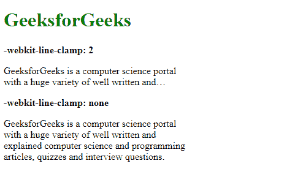
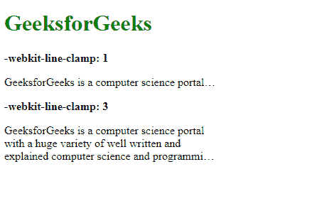
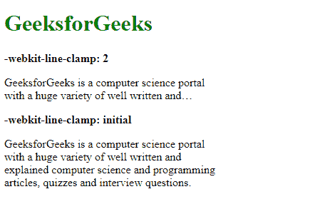

# CSS | web kit-线夹属性

> 原文:[https://www . geesforgeks . org/CSS-web kit-line-clamp-property/](https://www.geeksforgeeks.org/css-webkit-line-clamp-property/)

**-webkit-line-clamp** 属性用于限制块容器可能包含的行数。仅当“显示”属性设置为“-webkit-box”或“-webkit-inline-box”且“-webkit-box-orient”属性设置为“垂直”时，此属性才有效。

**语法:**

```
-webkit-line-clamp: none | integer | initial | inherit
```

**属性值:**

*   **none:** It is used to specify that the content will not be clamped. It is the default value.

    **示例:**

    ```
    <!DOCTYPE html>
    <html>
    <head>
      <title>
        -webkit-line-clamp property
      </title>
      <style>

        /* Clipped text for
          comparison */
        .content-1 {
          width: 300px;
          display: -webkit-box;
          -webkit-box-orient: vertical;
          -webkit-line-clamp: 2;
          overflow: hidden;
        }

        .content-2 {
          width: 300px;
          display: -webkit-box;
          -webkit-box-orient: vertical;
          -webkit-line-clamp: none;
          overflow: hidden;
        }
      </style>
    </head>
    <body>
      <h1 style="color: green;">
        GeeksforGeeks
      </h1>
      <b>
        -webkit-line-clamp: 2
      </b>
      <p class="content-1">
        GeeksforGeeks is a computer
        science portal with a huge
        variety of well written and
        explained computer science
        and programming articles,
        quizzes and interview questions.
      </p>
      <b>-webkit-line-clamp: none</b>
      <p class="content-2">
        GeeksforGeeks is a computer
        science portal with a huge
        variety of well written and
        explained computer science
        and programming articles,
        quizzes and interview questions.
      </p>
    </body>
    </html>
    ```

    **输出:**
    

*   **integer:** It is used to specify the number of lines after which the content would be clipped. This value should be greater than 0.

    **示例:**

    ```
    <!DOCTYPE html>
    <html>
    <head>
      <title>
        -webkit-line-clamp
      </title>
      <style>
        .content-1 {
          width: 300px;
          display: -webkit-box;
          -webkit-box-orient: vertical;
          -webkit-line-clamp: 1;
          overflow: hidden;
        }

        .content-2 {
          width: 300px;
          display: -webkit-box;
          -webkit-box-orient: vertical;
          -webkit-line-clamp: 3;
          overflow: hidden;
        }
      </style>
    </head>
    <body>
      <h1 style="color: green;">
        GeeksforGeeks
      </h1>
      <b>
        -webkit-line-clamp: 1
      </b>
      <p class="content-1">
        GeeksforGeeks is a computer
        science portal with a huge
        variety of well written and
        explained computer science
        and programming articles,
        quizzes and interview questions.
      </p>
      <b>-webkit-line-clamp: 3</b>
      <p class="content-2">
        GeeksforGeeks is a computer
        science portal with a huge
        variety of well written and
        explained computer science
        and programming articles,
        quizzes and interview questions.
      </p>
    </body>
    </html>
    ```

    **输出:**
    

*   **initial:** It is used to set the property to its default value.

    **示例:**

    ```
    <!DOCTYPE html>
    <html>
    <head>
      <title>
        -webkit-line-clamp
      </title>
      <style>
          /* Clipped text for
          comparison */
        .content-1 {
          width: 300px;
          display: -webkit-box;
          -webkit-box-orient: vertical;
          -webkit-line-clamp: 2;
          overflow: hidden;
        }

        .content-2 {
          width: 300px;
          display: -webkit-box;
          -webkit-box-orient: vertical;
          -webkit-line-clamp: initial;
          overflow: hidden;
        }
      </style>
    </head>
    <body>
      <h1 style="color: green;">
        GeeksforGeeks
      </h1>
      <b>-webkit-line-clamp: 2</b>
      <p class="content-1">
        GeeksforGeeks is a computer
        science portal with a huge
        variety of well written and
        explained computer science
        and programming articles,
        quizzes and interview questions.
      </p>
      <b>-webkit-line-clamp: initial</b>
      <p class="content-2">
        GeeksforGeeks is a computer
        science portal with a huge
        variety of well written and
        explained computer science
        and programming articles,
        quizzes and interview questions.
      </p>
    </body>
    </html>
    ```

    **输出:**
    

*   **继承:**用于从其父级继承属性。

**支持的浏览器:****-网络工具包-线夹**属性支持的浏览器如下:

*   谷歌 Chrome
*   火狐浏览器
*   旅行队
*   歌剧