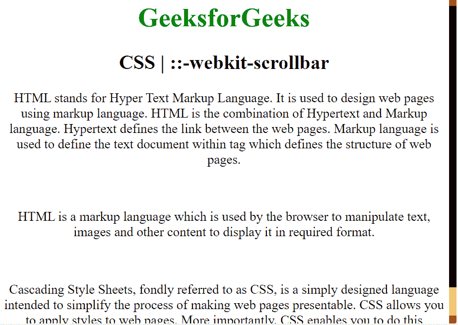

# CSS |:-WebKit-scroll bar

> 原文:[https://www.geeksforgeeks.org/css-webkit-scrollbar/](https://www.geeksforgeeks.org/css-webkit-scrollbar/)

**::-webkit-scrollbar** 是 CSS 中的一个伪元素，用于修改浏览器滚动条的外观。
在我们开始讨论它如何工作以及如何实现之前，我们需要了解一些关于元素的事实。

*   像 Chrome、Safari 和 Opera 这样的浏览器都支持这个标准
*   像火狐这样的浏览器不支持这个

对于 webkit 浏览器，您可以使用以下伪元素来自定义浏览器的滚动条:

*   **::-web kit-滚动条**:滚动条
*   **::-网络工具包-滚动条-按钮**:滚动条上向上或向下的箭头
*   **::-web kit-scroll bar-thumb**:可以拖动的滚动手柄
*   **::-web kit-scroll bar-track**:进度条
*   **::-web kit-scroll bar-track-piece**:手柄未覆盖的区域
*   **::-web kit-scroll bar-corner**:滚动条的底角，垂直滚动条和水平滚动条在此交汇
*   **::-webkit-resizer** :出现在某些元素底角的可拖动的大小调整手柄

以下示例采用了每个元素，并解释了它的正确用法(我还尝试对每个元素使用不同的颜色，以便可以分别突出显示每个标签的用途):

```css
<!Doctype>
<html>

<head>
    <title>scroll customization</title>
    <style type="text/css">
        body {
            font-size: 20pt;
        }
        /* tells the browser how the bar will look */

        ::-webkit-scrollbar {
            width: 15px;
            border: 2px solid blue;
        }
        /*tells the browser how the arrows will appear*/

        ::-webkit-scrollbar-button:single-button {
            background-color: red;
            height: 16px;
            width: 16px;
        }
        /* tells the browser how the scrollable 
          handle would look like */

        ::-webkit-scrollbar-thumb {
            background: black;
        }
        /* tells the browser how will the 
         path of the handle will look like */

        ::-webkit-scrollbar-track {
            background: yellow;
        }
        /* works the same as ::-webkit-scrollbar-track 
              but tells the browser how the path where 
              the handle is not present currently*/
        /* ::-webkit-scrollbar-track-piece{
            background: green;
        } */
        /* tells the browser how will the point 
           where vertical and  horizontal meet will look like*/
        /* ::-webkit-scrollbar-corner{
            background: orange ;
            display: solid;
        } */
        /* resizer*/

        ::-webkit-resizer {
            background: pink;
        }
    </style>
</head>

<body>
    <center>
        <h1 style="color:green">GeeksforGeeks</h1>
        <h2>CSS |::-webkit-scrollbar</h2>
        <p>HTML stands for Hyper Text Markup Language. 
          It is used to design web pages using markup language. 
          HTML is the combination of Hypertext and Markup language. 
          Hypertext defines the link between 
          the web pages. Markup language is used to 
          define the text document within tag which 
          defines the structure of web pages.</p>
        <br>
        <p>HTML is a markup language which is used by 
           the browser to manipulate text, images and 
          other content to display it in required format.</p>
        <br>
        <p>Cascading Style Sheets, fondly 
           referred to as CSS, is a simply
          designed language intended to simplify 
          the process of making web
          pages presentable. CSS allows you to 
           apply styles to web pages.
          More importantly, CSS enables you to 
          do this independent of the
          HTML that makes up each web page.</p>
    </center>
</body>

</html>
```

**输出:** 

**支持的浏览器:**支持的浏览器**CSS |:-WebKit-scroll bar**如下:

*   谷歌 Chrome
*   苹果 Safari
*   歌剧