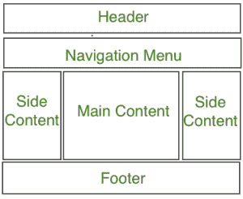

# CSS |网站布局

> 原文:[https://www.geeksforgeeks.org/css-website-layout/](https://www.geeksforgeeks.org/css-website-layout/)

一个网站可以分为不同的部分，包括标题、菜单、内容和页脚，在此基础上有许多不同的布局设计可供开发人员使用。不同的布局可以通过使用 div 标签和使用 CSS 属性来创建样式。
网站布局最常见的结构如下:


**注意:**表头部分包含网站 logo、搜索栏和用户简介。导航菜单包含各种可用文章类别的链接，内容部分分为 3 个部分(栏)，左右侧边栏包含其他文章和广告的链接，而主要内容部分包含这篇文章，然后在底部有一个包含地址、链接、联系人等的页脚部分。
**标题区:**标题区通常位于网站顶部或顶部导航菜单的正下方。它通常由网站名称或网站标志组成。

**示例:**

## 超文本标记语言

```html
<!-- This code describes the header section
of website layout -->
<!DOCTYPE html>
<html>
    <head>
        <title>
            Website Layouts
        </title>

        <style>
            .header {
                background-color: green;
                padding: 15px;
                text-align: center;
            }
        </style>
    </head>

    <body>
        <div class = "header">
            <h2 style = "color:white;">
                GeeksforGeeks
            </h2>
        </div>
        <br>

        <center style="font-size:200%;">
            Remaining Section
        </center>
    </body>
</html>                   
```

**输出:**


**导航菜单:**导航栏/菜单基本上是一个链接列表，允许访问者轻松舒适地浏览网站。

**示例:**

## 超文本标记语言

```html
<!DOCTYPE html>
<html>
    <head>
        <title>
            Website Layout
        </title>

        <style>

            /* CSS property for header section */
            .header {
                background-color: green;
                padding: 15px;
                text-align: center;
            }

            /* CSS property for navigation menu */
            .nav_menu {
                overflow: hidden;
                background-color: #333;
            }
            .nav_menu a {
                float: left;
                display: block;
                color: white;
                text-align: center;
                padding: 14px 16px;
                text-decoration: none;
            }
            .nav_menu a:hover {
                background-color: white;
                color: green;
            }
        </style>
    </head>

    <body>

        <!-- header of website layout -->
        <div class = "header">
            <h2 style = "color:white;font-size:200%;">
                GeeksforGeeks
            </h2>
        </div>

        <!-- navigation menu for website layout -->
        <div class = "nav_menu">
            <a href = "#">Algo</a>
            <a href = "#">DS</a>
            <a href = "#">Language</a>
        </div><br>

        <center style = "font-size:200%;">
            Remaining Section
        </center>
    </body>
</html>                   
```

**输出:**


**内容版块:**内容版块是网站的主体。用户可以在 n 列布局中划分内容部分。
最常见的布局是:

*   **1-列布局:**多用于移动布局。


*   **2 列布局:**此网站布局多用于平板或笔记本电脑。


*   **3 列布局:**该网站布局多用于桌面。



用户还可以创建一个响应布局，其中布局将根据屏幕大小进行更改。考虑下面的例子，如果屏幕宽度大于 600px，那么将有 3 列布局，如果屏幕宽度在 400px 到 600px 之间，那么将有 2 列布局，如果屏幕尺寸小于 400px，那么将显示 1 列布局。

**示例:**

## 超文本标记语言

```html
<!DOCTYPE html>
<html>
    <head>
        <title>
            Website Layout
        </title>
        <style>
            * {
                box-sizing: border-box;
            }

            /* CSS property for header section */
            .header {
                background-color: green;
                padding: 15px;
                text-align: center;
            }

            /* CSS property for navigation menu */
            .nav_menu {
                overflow: hidden;
                background-color: #333;
            }
            .nav_menu a {
                float: left;
                display: block;
                color: white;
                text-align: center;
                padding: 14px 16px;
                text-decoration: none;
            }
            .nav_menu a:hover {
                background-color: white;
                color: green;
            }

            /* CSS property for content section */
            .columnA, .columnB, .columnC {
                float: left;
                width: 31%;
                padding: 15px;
                text-align:justify;
            }
            h2 {
                color:green;
                text-align:center;
            }

            /* Media query to set website layout
            according to screen size */
            @media screen and (max-width:600px) {
                .columnA, .columnB, .columnC {
                    width: 50%;
                }
            }
            @media screen and (max-width:400px) {
                .columnA, .columnB, .columnC {
                    width: 100%;
                }
            }
        </style>
    </head>

    <body>

        <!-- header of website layout -->
        <div class = "header">
            <h2 style = "color:white;font-size:200%">
                GeeksforGeeks
            </h2>
        </div>

        <!-- navigation menu of website layout -->
        <div class = "nav_menu">
            <a href = "#">Algo</a>
            <a href = "#">DS</a>
            <a href = "#">Language</a>
        </div>

        <!-- Content section of website layout -->
        <div class = "row">

            <div class = "columnA">
                <h2>Column A</h2>

<p>Prepare for the Recruitment drive of product
                based companies like Microsoft, Amazon, Adobe
                etc with a free online placement preparation
                course. The course focuses on various MCQ's
                & Coding question likely to be asked in the
                interviews & make your upcoming placement
                season efficient and successful.</p>

            </div>

            <div class = "columnB">
                <h2>Column B</h2>

<p>Prepare for the Recruitment drive of product
                based companies like Microsoft, Amazon, Adobe
                etc with a free online placement preparation
                course. The course focuses on various MCQ's
                & Coding question likely to be asked in the
                interviews & make your upcoming placement
                season efficient and successful.</p>

            </div>

            <div class = "columnC">
                <h2>Column C</h2>

<p>Prepare for the Recruitment drive of product
                based companies like Microsoft, Amazon, Adobe
                etc with a free online placement preparation
                course. The course focuses on various MCQ's
                & Coding question likely to be asked in the
                interviews & make your upcoming placement
                season efficient and successful.</p>

            </div>
        </div>
    </body>
</html>                   
```

**输出:**
**屏幕尺寸大于 700 像素的宽度:**


**屏幕尺寸大于 400 像素小于 600 像素的宽度:**


**屏幕尺寸小于 400 像素的宽度:**


**页脚部分:**页脚部分位于网页的底部，它通常由联系信息、版权、关于我们等信息组成。

**示例:**

## 超文本标记语言

```html
<!DOCTYPE html>
<html>
    <head>
        <title>
            CSS Website Layout
        </title>

        <style>

            /* Style for footer section */
            .footer {
                background-color: green;
                padding: 15px;
                text-align: center;
            }
        </style>
    </head>

    <body>
        <center style = "font-size:200%;">
            Upper section
        </center>

        <!-- footer Section -->
        <div class = "footer">
            <a href = "#">About</a><br>
            <a href = "#">Career</a><br>
            <a href = "#">Contact Us</a>
        </div>
    </body>
</html>                   
```

**输出:**


**支持的浏览器:**

*   谷歌 Chrome
*   微软公司出品的 web 浏览器
*   火狐浏览器
*   歌剧
*   旅行队