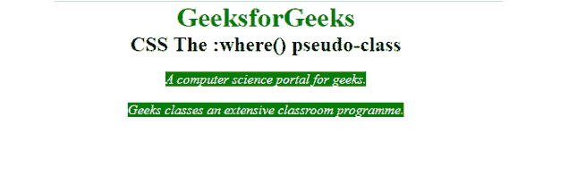
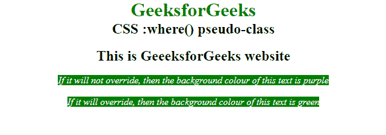

# CSS:其中()伪类

> 原文:[https://www.geeksforgeeks.org/css-where-pseudo-class/](https://www.geeksforgeeks.org/css-where-pseudo-class/)

[:where()](https://www.geeksforgeeks.org/css-pseudo-classes/) 伪类有助于在较长的 CSS 选择器列表中最小化较长的代码。它避免了重复，只需用一个选择器替换多个选择器。在:where()伪类中，您也可以重写。

**语法:**

```css
class_Name :where(html-tages) html-tag {
    /* CSS code */
}
```

**不带:where()伪类的选择器:**

```css
.className li em,
.className section em,
.className p em {
    // CSS code
}
```

**选择器，带:where()伪类:**

```css
className :where(li, section, p) em {
    //CSS code
}
```

**例 1:**

## 超文本标记语言

```css
<!DOCTYPE html>
<html>

<head>
    <style>
        * {
            margin: 0;
            padding: 0;
            box-sizing: border-box;
        }

        /* CSS selector with :where() psuedo-class */
        .GeeeksforGeeks :where(section, p) em {
            background: green;
            color: white;
        }
    </style>
</head>

<body style="text-align:center">
    <h1 style="color:green;">
        GeeksforGeeks
    </h1>

    <h2>CSS The :where() pseudo-class</h2>

    </br>
    <div class="GeeeksforGeeks">
        <p><em>
            A computer science portal 
            for geeks.
        </em></p>
        </br>

        <section>
            <em>
                Geeks classes an extensive 
                classroom programme.
            </em>
        </section>
    </div>
</body>

</html>
```

**输出:**



伪类在哪里

**示例 2:** 很容易覆盖:where()伪类，如下例所示。

## 超文本标记语言

```css
<!DOCTYPE html>
<html>

<head>
    <style>
        * {
            margin: 0;
            padding: 0;
            box-sizing: border-box;
        }

        /* CSS selector with :where() 
        psuedo-class overriden */
        .GeeeksforGeeks :where(section, p) em {
            background: rgb(231, 118, 231);
            color: white;
        }

        .GeeeksforGeeks em {
            background: green;
            color: white;
        }
    </style>
</head>

<body style="text-align:center">
    <h1 style="color:green;">
        GeeksforGeeks
    </h1>
    <h2>
        CSS :where() pseudo-class
    </h2>
    </br>
    <div class="GeeeksforGeeks">
        <h2>This is GeeeksforGeeks website</h2> </br>
        <p>
            <em>
                If it will not override, then 
                the background colour of this 
                text is purple
            </em>
        </p></br>
        <section>
            <em>
                If it will override, then the 
                background colour of this text 
                is green
            </em>
        </section>
    </div>
</body>

</html>
```

**输出:**



伪类在哪里

**浏览器支持:**

*   Firefox 78+
*   Chrome 72(通过实验性网络平台功能启用)