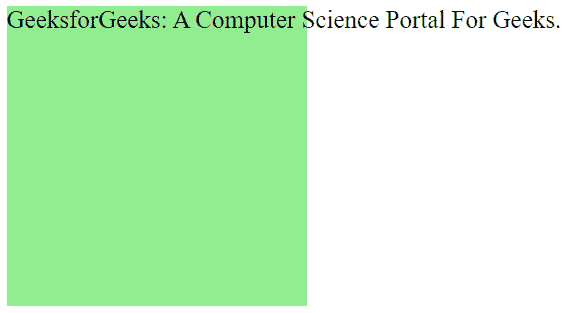
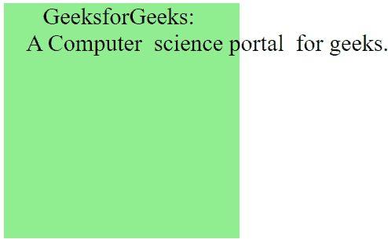
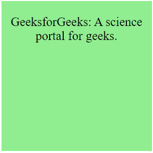
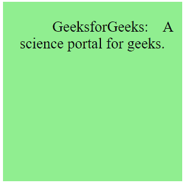

# CSS 空白属性

> 原文:[https://www.geeksforgeeks.org/css-white-space-property/](https://www.geeksforgeeks.org/css-white-space-property/)

CSS 中的**空白属性**用于控制文本换行和空白 ie。，此属性可用于设置元素内部空白的处理。此属性中有几种类型的值可供使用。

**语法:**

```html
white-space: normal| nowrap| pre| pre-line| pre-wrap| initial| inherit;
```

**属性值:**下面的例子很好地描述了所有的属性。

**正常:**这是该属性的默认值。当 CSS 的空白属性设置为正常时，两个或更多空白的每个序列将显示为一个空白。元素中的内容将在任何需要的地方换行。

**语法:**

```html
white-space: normal; 
```

**示例:**本示例说明了属性值设置为“正常”的**空白**属性的使用。

## 超文本标记语言

```html
<!DOCTYPE html>
<html>
<head>
    <title> CSS | white-space Property </title>
    <style>
    div {
        width: 500px;
        height: 500px;
        white-space: normal;
        background-color: limegreen;
        color: white;
        font-size: 80px;
    }
    </style>
</head>

<body>
    <center>
        <div> GeeksforGeeks:
            <br> A Computer Science Portal For Geeks.
        </div>
    </center>
</body>
</html>
```

**输出:**


正常值的空白属性 CSS

**nowrap:** 当 CSS 的空白属性设置为 nowrap 时，两个或更多空白的每个序列将显示为单个空白。除非明确指定，否则元素中的内容不会换行。

**语法:**

```html
white-space: nowrap;
```

**示例:**此示例说明了属性值设置为 nowrap 的**空白**属性的使用。

## 超文本标记语言

```html
<!DOCTYPE html>
<html>
<head>
    <title> CSS | white-space Property </title>
    <style>
    div {
        width: 300px;
        height: 300px;
        white-space: nowrap;
        background-color: lightgreen;
        color: black;
        font-size: 25px;
    }
    </style>
</head>

<body>
    <center>
        <div>GeeksforGeeks:
          A Computer Science Portal For Geeks.
        </div>
    </center>
</body>
</html>
```

**输出:**



具有 nowrap 值的空白属性

**pre:** 该值使空白具有与 HTML 中 [< pre >](https://www.geeksforgeeks.org/html-pre-tag/) 标签相同的效果。元素中的内容只有在使用换行符指定时才会换行。

**语法:**

```html
white-space: pre;
```

**示例:**本示例说明了属性值设置为 pre 的**空白**属性的使用。

## 超文本标记语言

```html
<!DOCTYPE html>
<html>
<head>
    <title> CSS | white-space Property </title>
    <style>
    div {
        width: 300px;
        height: 300px;
        white-space: pre;
        background-color: lightgreen;
        color: black;
        font-size: 25px;
    }
    </style>
</head>

<body>
    <center>
        <div>
          GeeksforGeeks: A Computer science portal for geeks.
        </div>
    </center>
</body>
</html>
```

**输出:**



带有预设值的空白属性

**行前:**当 CSS 的空白属性设置为行前值时，每两个或多个空白的序列将显示为单个空白。当需要和明确指定时，元素中的内容将被包装。

**语法:**

```html
white-space: pre-line; 
```

**示例:**本示例说明了属性值设置为行前的**空白**属性的使用。

## 超文本标记语言

```html
<!DOCTYPE html>
<html>
<head>
    <title> CSS | white-space Property </title>
    <style>
    div {
        width: 300px;
        height: 300px;
        white-space: pre-line;
        background-color: lightgreen;
        color: black;
        font-size: 25px;
    }
    </style>
</head>

<body>
    <center>
        <div>
            GeeksforGeeks:    A science portal for geeks.
        </div>
    </center>
</body>
</html>
```

**输出:**



空白属性行前值

**预换行:**当 CSS 的空格属性设置为行前值时，每一个空格序列都会按原样出现。当需要和明确指定时，元素中的内容将被包装。

**语法:**

```html
white-space: pre-wrap; 
```

**示例:**本示例说明了属性值设置为预包装的**空白**属性的使用。

## 超文本标记语言

```html
<!DOCTYPE html>
<html>
<head>
    <title> CSS | white-space Property </title>
    <style>
    div {
        width: 300px;
        height: 300px;
        white-space: pre-wrap;
        background-color: lightgreen;
        color: black;
        font-size: 25px;
    }
    </style>
</head>

<body>
    <center>
        <div>
            Geeks For Geeks:    A science portal for geeks.
        </div>
    </center>
</body>
</html>
```

**输出:**



空白预包装值

**初始值:**该值将空白属性设置为默认值。

**语法:**

```html
white-space: initial; 
```

**inherit:** 该值将空白属性设置为父元素的值。

**语法:**

```html
white-space: inherit; 
```

**支持的浏览器:**由**空白属性**支持的浏览器如下:

*   谷歌 Chrome 1.0
*   微软边缘 12.0
*   Firefox 3.5
*   Internet Explorer 5.5
*   歌剧 9.5
*   Safari 3.0