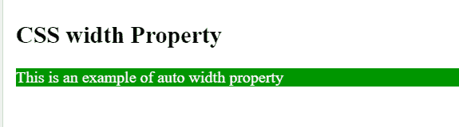
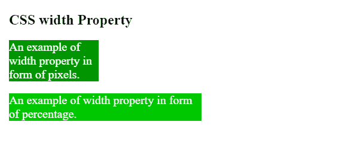
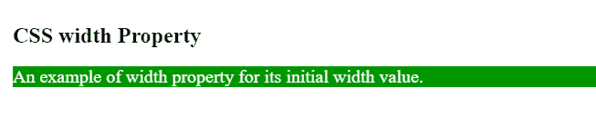

# CSS 宽度属性

> 原文:[https://www.geeksforgeeks.org/css-width-property/](https://www.geeksforgeeks.org/css-width-property/)

CSS 中的**宽度属性**用于设置文本、图像的宽度。宽度可以像素(px)、百分比(%)、厘米(cm)等形式分配给文本和图像。width 属性不包含填充、边框或边距。宽度属性被[最小宽度](https://www.geeksforgeeks.org/css-min-width-property/) & [最大宽度](https://www.geeksforgeeks.org/css-max-width-property/)属性覆盖。默认情况下，width 属性设置内容区域的宽度，尽管如果[框大小](https://www.geeksforgeeks.org/css-box-sizing-property/)的值设置为边框，它将设置边框区域的宽度。

**语法:**

```css
width: auto | value | initial | inherit;
```

**注意:**元素的宽度属性不涉及填充、边框&边距。

**默认值:**其默认值为自动。

**属性值:**下面的例子很好地描述了所有的属性。

**自动:**用于将宽度属性设置为默认值。如果宽度属性设置为自动，浏览器将计算元素的宽度。

**语法:**

```css
width: auto;
```

**示例:**本示例演示了**宽度属性**的使用，其值设置为自动。

## 超文本标记语言

```css
<!DOCTYPE html>
<html>
<head>
    <title> CSS width Property </title>
    <style>
    .gfg {
        width: auto;
        color: white;
        font-size: 20px;
        background-color: rgb(0, 150, 0);
    }

    h2 {
        font-size: 20px;
        color: black;
    }
    </style>
</head>

<body>
    <h2>
      CSS width Property
    </h2>
    <p class="gfg">
      This is an example of auto width property
    </p>

</body>
</html>
```

**输出:**



**值:**用于以像素(px)、百分比(%)、厘米(cm)等形式设置宽度。宽度不能为负。

**语法:**

```css
width: value;
```

**示例:**该示例演示了**宽度属性**的使用，其值可以用像素(px)、百分比(%)、厘米(cm)等来定义。

## 超文本标记语言

```css
<!DOCTYPE html>
<html>
<head>
    <title> CSS Width Property </title>
    <style>
    .gfg {
        width: 150px;
        color: white;
        font-size: 20px;
        background-color: RGB(0, 150, 0);
    }

    .gfg1 {
        width: 50%;
        color: white;
        font-size: 20px;
        background-color: RGB(0, 200, 0);
    }

    h2 {
        color: black;
    }
    </style>
</head>

<body>
    <h2>
        CSS width Property
    </h2>
    <p class="gfg">
         An example of width property in form of pixels.
    </p>

    <p class="gfg1">
        An example of width property in form of percentage.
    </p>

</body>
</html>
```

**输出:**



[](https://www.geeksforgeeks.org/css-value-initial/)****:**用于将元素的 CSS 属性设置为默认值。**

****语法:****

```css
width: initial;
```

****示例:**本示例演示了**宽度属性**的使用，其值设置为初始值。**

## **超文本标记语言**

```css
<!DOCTYPE html>
<html>
<head>
    <title> CSS Width Property </title>
    <style>
    .gfg {
        width: initial;
        color: white;
        font-size: 20px;
        background-color: RGB(0, 150, 0);
    }

    h2 {
        color: black;
    }
    </style>
</head>

<body>
    <h2>
        CSS width Property
    </h2>
    <p class="gfg">
        An example of width property for its initial width value.
    </p>

</body>
</html>
```

****输出:****

****

**[**继承**](https://www.geeksforgeeks.org/css-value-inherit/) **:** 用于从元素的父元素属性值继承元素的属性。**

****支持的浏览器:****

*   **谷歌 Chrome 1.0**
*   **Internet Explorer 4.0**
*   **微软边缘 12.0**
*   **Firefox 1.0**
*   **Safari 1.0**
*   **歌剧 3.5**