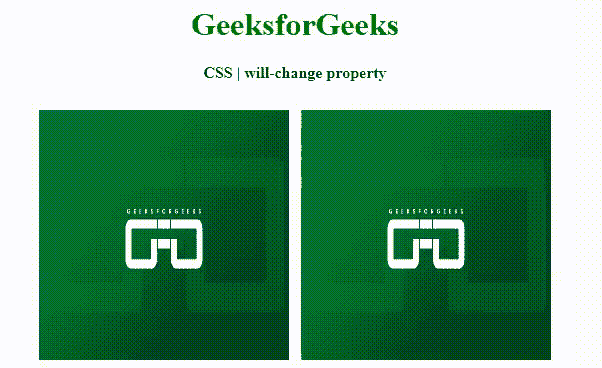

# CSS |意志改变属性

> 原文:[https://www.geeksforgeeks.org/css-will-change-property/](https://www.geeksforgeeks.org/css-will-change-property/)

**will-change 属性**在少数情况下是动画的替换，当页面花时间加载时，所有的动画看起来都会跳动几次。但是在意志改变的情况下，那些动画的东西会表现得很流畅。

**语法:**

```
will-change: auto | <animateable-feature>#
```

**属性值:**

*   **auto:** 在这里，开发人员应该应用它通常会做的任何试探法和优化。
*   **<可动画化-功能> :** 这里开发者可以定义开发者想要展示什么样的动画。

**示例:**该示例说明了意志改变属性。

```
<!DOCTYPE html> 
<html> 

<head> 
    <title> 
        CSS | will-change property 
    </title> 

    <style> 
        h1 { 
            color: green; 
        } 
        .left{
            will-change: transform;
            transition: 1s;
        }
        .left:hover { 
            transform: rotateX(45deg); 
        } 
    </style> 
</head> 

<body> 
    <center> 
        <h1>GeeksforGeeks</h1> 

        <h4>CSS | will-change property</h4> 

        <div> 
             

             
        </div> 
    </center> 
<body> 

</html> 
```

**输出:**


**支持的浏览器:**CSS 将改变属性支持的浏览器如下:

*   谷歌 Chrome
*   火狐浏览器
*   旅行队
*   歌剧