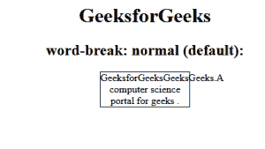
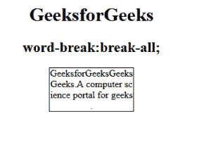
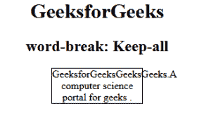
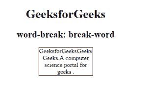
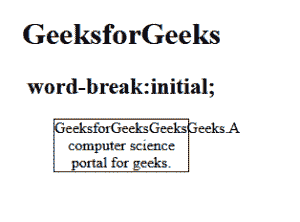

# CSS |断字属性

> 原文:[https://www.geeksforgeeks.org/css-word-break-property/](https://www.geeksforgeeks.org/css-word-break-property/)

此断字属性用于指定当单词到达行尾时如何断字。文本中的换行符可能出现在某些空格中，比如有空格或连字符时。

**语法:**

```css
word-break: normal|break-all|keep-all|break-word|initial|inherit;
```

**默认值:正常**

**属性:**有断字属性，如下所示:

*   常态
*   全包
*   全部保留
*   最初的
*   继承

**正常:**该属性使用默认的换行规则。
**语法:**

```css
word-break: normal (default value)
```

**示例:**

## 超文本标记语言

```css
<!DOCTYPE html>
<html>
    <head>
        <title>
            CSS | word-break Property
        </title>
        <style>
            p {
                width: 140px;
                border: 1px solid #000000;
            }

            gfg.a {
                word-break: normal;
            }
        </style>
    </head>
    <body>
        <center>
            <h1>GeeksforGeeks</h1>
            <h2>word-break: normal (default):</h2>
            <p class="gfg">GeeksforGeeksGeeksGeeks.
            A computer science portal for geeks .</p>

        </center>
    </body>
</html>                   
```

**输出:**



**断字:**用于任意字符处断字，防止溢出。
**语法:**

```css
break-word: break-all
```

**示例:**

## 超文本标记语言

```css
<!DOCTYPE html>
<html>
    <head>
        <title>
            CSS | word-break Property
        </title>
        <style>
            p {
                width: 142px;
                border: 1px solid #000000;
            }

            p.gfg {
                word-break: break-all;
            }
        </style>
    </head>
    <body>
        <center>
            <h1 style="color:green;">GeeksforGeeks</h1>
            <h2>word-break: break-all;</h2>
            <p class="gfg">GeeksforGeeksGeeksGeeks. A
            computer science portal for geeks .</p>

        </center>
    </body>
</html>
```

**输出:**



**保留全部:**与值正常相同。
**注:**不宜用于中/日/韩文文本。
**语法:**

```css
word-break: Keep-all;
```

**例:**

## 超文本标记语言

```css
<!DOCTYPE html>
<html>
    <head>
        <title>
            CSS | word-break Property
        </title>
        <style>
        p {
            width: 140px;
            border: 1px solid #000000;
            color:black;
        }
        p.gfg {
            word-break: keep-all;
        }
        </style>
    </head>
    <body>
        <center>
            <h1>GeeksforGeeks</h1>
            <h2>word-break: Keep-all</h2>
            <p class="gfg">GeeksforGeeksGeeksGeeks.A
            computer science portal for geeks .</p>

        </center>
    </body>
</html>
```

**输出:**



**断字:**用于任意点断字，防止溢出。
**语法:**

```css
word-break: break-word;
```

**示例:**

## 超文本标记语言

```css
<!DOCTYPE html>
<html>
    <head>
        <title>
            CSS | word-break Property
        </title>
        <style>
            p {
                width: 140px;
                border: 1px solid #000000;
                color:black;
            }
            p.gfg {
                word-break: break-word;
            }
        </style>
    </head>
    <body>
        <center>
            <h1>GeeksforGeeks</h1>
            <h2>word-break: break-word</h2>
            <p class="gfg">GeeksforGeeksGeeksGeeks.A
            computer science portal for geeks .</p>

        </center>
    </body>
</html>
```

**输出:**



**初始值:**将属性设置为默认值。
**语法:**

```css
word-break:initial;
```

**例:**

## 超文本标记语言

```css
<!DOCTYPE html>
<html>
    <head>
        <title>
            CSS | word-break Property
        </title>
        <style>
            p {
                width: 140px;
                border: 1px solid #000000;
                color:black;
            }
            p.gfg {
                word-break:initial;
            }
        </style>
    </head>
    <body>
        <center>
            <h1>GeeksforGeeks</h1>
            <h2>word-break:initial;</h2>
            <p class="gfg">GeeksforGeeksGeeksGeeks.A
            computer science portal for geeks.</p>

        </center>
    </body>
</html>
```

**输出:**



**支持的浏览器:**T2 断字属性支持的浏览器如下:

*   谷歌 Chrome
*   微软公司出品的 web 浏览器
*   火狐浏览器
*   歌剧
*   旅行队