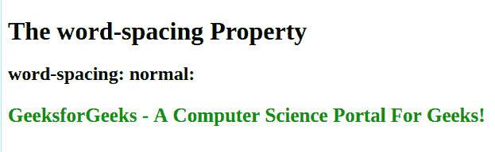

# CSS |字间距属性

> 原文:[https://www.geeksforgeeks.org/css-word-spacing-property/](https://www.geeksforgeeks.org/css-word-spacing-property/)

增加或减少单词之间的空白是 CSS 属性。该属性只能有两个值，即正常值和长度值。
**语法:**

```css
word-spacing: normal|length|initial|inherit;

```

**属性值:**

*   **Normal:** It defines normal space between words which is 0.25em. This is *default* value.
    **Example:**

    ```css
    <!DOCTYPE html>
    <html>
    <head>
        <title>
          CSS | word-spacing Property
        </title>
    </head>
    <body>
        <h1>The word-spacing Property</h1>

        <h2>word-spacing: normal:</h2>
        <p style="  word-spacing: normal;
                    color:green; 
                    font-weight:bold;
                    font-size:25px;">
            This is some text. This is some text.
        </p>
    </body>

    </html>
    ```

    **输出:**
    

*   **Length:** It defines an additional space between words (in px, pt, cm, em, etc). Negative values are also allowed.
    **Example:**

    ```css
    <!DOCTYPE html>
    <html>
    <head>
        <title>
          CSS | word-spacing Property
        </title>
    </head>
    <body>
        <h1>The word-spacing Property</h1>

        <h2>word-spacing: length is 20px</h2>
        <p style="  word-spacing:20px;
                    color:green; 
                    font-weight:bold;
                    font-size:25px;">
            GeeksforGeeks - A Computer Science Portal For Geeks!
        </p>
    </body>

    </html>
    ```

    **输出:**
    

    **示例:**长度为负值

    ```css
    <!DOCTYPE html>
    <html>
    <head>
        <title>
          CSS | word-spacing Property
        </title>
    </head>
    <body>
        <h1>The word-spacing Property</h1>

        <h2>word-spacing: length is -20px</h2>
        <p style="word-spacing:-20px;
                  color:green;
                  font-weight:bold;
                  font-size:25px;">
            GeeksforGeeks - A Computer Science Portal For Geeks!
        </p>
    </body>

    </html>
    ```

    **输出:**
    

    **支持的浏览器:***字距属性*支持的浏览器如下:

    *   谷歌 Chrome 1.0
    *   Internet Explorer 6.0
    *   Firefox 1.0
    *   歌剧 3.5
    *   Safari 1.0