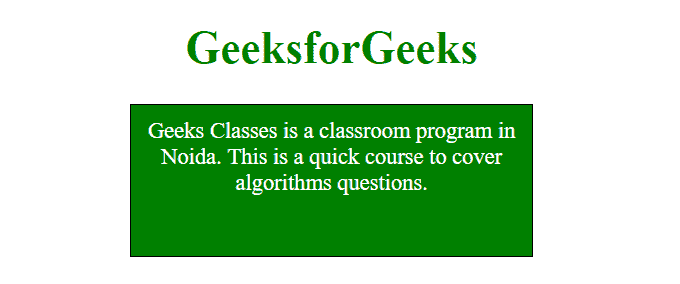
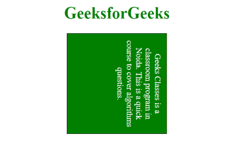
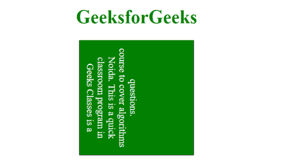

# CSS |书写模式属性

> 原文:[https://www.geeksforgeeks.org/css-writing-mode-property/](https://www.geeksforgeeks.org/css-writing-mode-property/)

书写模式 CSS 属性用于表示文本行是水平布局还是垂直布局，以及块前进的方向。

**语法:**

```css
writing-mode: horizontal-tb|vertical-rl|vertical-lr;

```

**默认值:**其默认值为水平-tb。

**属性值**:

*   **horizontal-tb:**This mode lets the content flow horizontally from left to right, vertically from top to bottom. The next horizontal line is positioned below the previous line.

    **语法:**

    ```css
    writing-mode: horizontal-tb;

    ```

    **示例:**

    ```css
    <!DOCTYPE html>
    <html>
        <head>
            <title>writing-mode Property</title>
            <style> 
                p.geek {
                    width: 300px;
                    height: 100px;
                    border: 1px solid black;
                    writing-mode: horizontal-tb;
                    color: white;
                    background: green;
                }
            </style>
        </head>
        <body style = "text-align: center;">
            <h1 style = "color:green;">GeeksforGeeks</h1>
            <p class="geek">
             Geeks Classes is a classroom program in Noida. 
             This is a quick course to cover algorithms 
             questions.
            </p>
        </body>
    </html>
    ```

    **输出:**
    

*   **vertical-rl:**This mode lets the content flow vertically from top to bottom, horizontally from right to left. The next vertical line is positioned to the left of the previous line.

    **语法:**

    ```css
    writing-mode: vertical-rl;

    ```

    **示例:**

    ```css
    <!DOCTYPE html>
    <html>
        <head>
            <title>writing-mode Property</title>
            <style> 
                p.geek {
                    width: 200px;
                    height: 200px;
                    border: 1px solid black;
                    writing-mode: vertical-rl;
                    color: white;
                    background: green;
                }
            </style>
        </head>
        <body style = "text-align: center;">
            <h1 style = "color:green;">GeeksforGeeks</h1>
            <p class="geek">
             Geeks Classes is a classroom program in Noida. 
             This is a quick course to cover algorithms 
             questions.
            </p>
        </body>
    </html>
    ```

    **输出:**
    

*   **vertical-lr:**This mode lets the content flow vertically from top to bottom, horizontally from left to right. The next vertical line is positioned to the right of the previous line.

    **语法:**

    ```css
    writing-mode: vertical-lr;

    ```

    **示例:**

    ```css
    <!DOCTYPE html>
    <html>
        <head>
            <title>writing-mode Property</title>
            <style> 
                p.geek {
                    width: 200px;
                    height: 200px;
                    border: 1px solid black;
                    writing-mode: vertical-lr;
                    color: white;
                    background: green;
                }
            </style>
        </head>
        <body style = "text-align: center;">
            <h1 style = "color:green;">GeeksforGeeks</h1>
            <p class="geek">
             Geeks Classes is a classroom program in Noida. 
             This is a quick course to cover algorithms 
             questions.
            </p>
        </body>
    </html>
    ```

    **输出:**
    

**支持的浏览器:**支持**书写模式**属性的浏览器如下:

*   谷歌 Chrome 48.0
*   Internet Explorer 12.0
*   Firefox 41.0
*   Opera 35.0
*   苹果 Safari 11.0