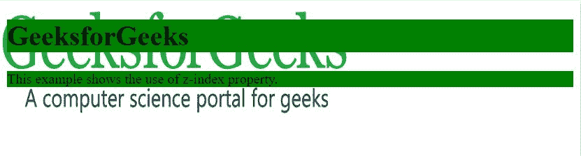
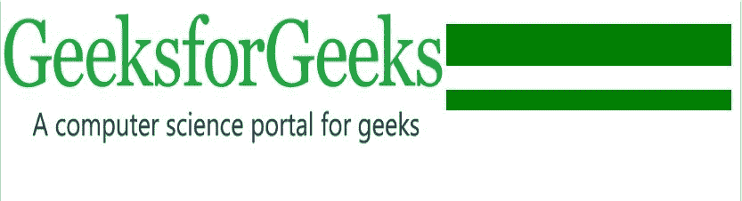

# CSS | z-index 属性

> 原文:[https://www.geeksforgeeks.org/css-z-index-property/](https://www.geeksforgeeks.org/css-z-index-property/)

z-index 属性用于在 z 轴上移动元素，即移入或移出屏幕。如果元素相互重叠，它用于定义元素的顺序。

**语法:**

```css
z-index: auto|number|initial|inherit;

```

**属性值:**

*   **自动:**堆叠顺序与父级相同(默认)。
*   **数字:**堆叠顺序取决于数字。
*   **初始**:将属性设置为默认值。
*   **继承:**从父元素继承属性。

**例 1:**

```css
<!DOCTYPE html>
<html>

<head>
    <title>
         z-index Property
    </title>
    <style>
        img {
            position: absolute;
            left: 0px;
            top: 0px;
            z-index: -1;
        }

        h1,
        p {
            background-color: green;
        }
    </style>
</head>

<body>

    <h1>GeeksforGeeks</h1>
    
    <p>This example shows the use of z-index property.</p>
</body>

</html>
```

**输出:**


**例 2:**

```css
<!DOCTYPE html>
<html>

<head>
    <title>
         z-index Property
    </title>
    <style>
        img {
            position: absolute;
            left: 0px;
            top: 0px;
            z-index: +1;
        }

        h1,
        p {
            background-color: green;
        }
    </style>
</head>

<body>

    <h1>GeeksforGeeks</h1>
    
    <p>This example shows the use of z-index property.</p>
</body>

</html>
```

**输出:**


在示例-1 中，z 索引设置为-1，因此图像出现在文本后面，但是在示例-2 中，当 z 索引设置为+1 时，图像隐藏了文本。

**支持的浏览器:**由 *z-index* 属性支持的浏览器如下:

*   谷歌 Chrome 1.0
*   Edge 12.0
*   Firefox 1.0
*   Opera 4.0
*   苹果 Safari 1.0