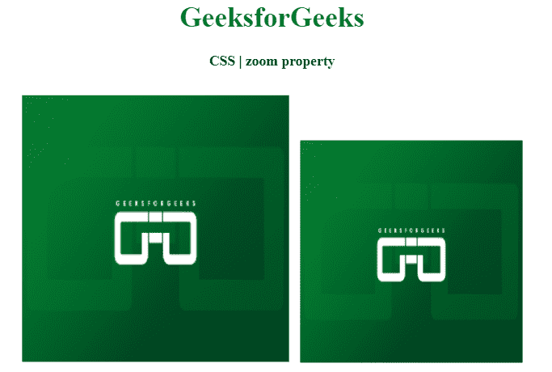

# CSS |缩放属性

> 原文:[https://www.geeksforgeeks.org/css-zoom-property/](https://www.geeksforgeeks.org/css-zoom-property/)

CSS 中的缩放属性用于放大或缩小内容。此属性是在其他一些浏览器支持 Internet Explorer 之前为其实现的。

**语法:**

```css
zoom: percentage | number | normal;
```

**属性值:**该属性接受三种类型的值，如上所述，如下所述:

*   **百分比:**该属性保存的数字与原始内容相比将增加或减少的百分比，使得放大或缩小取决于像`zoom:150%;`这样的数字。这意味着内容将比原始内容大 150%的百分比。
*   **数字:**该属性保存的数字将乘以原始内容，根据像`zoom:1.5;`这样的数字进行放大或缩小。这意味着内容将比原始内容大 1.5 倍。
*   **normal:** 这个属性保存的是不放大不缩小的正常内容，基本上这个属性就是在告诉浏览器`zoom:1`

**示例:**本示例使用 CSS 缩放属性调整图像大小。

```css
<!DOCTYPE html> 
<html> 

<head> 
    <title> 
        CSS | zoom property 
    </title> 

    <style> 
        h1 { 
            color: green; 
        } 
        .left{
            zoom: 1.2;
        }
    </style> 
</head> 

<body> 
    <center> 
        <h1>GeeksforGeeks</h1> 

        <h4>CSS | zoom property</h4> 

        <div> 
             

             
        </div> 
    </center> 
<body> 

</html>
```

**输出:**


**支持的浏览器:****CSS 缩放属性**支持的浏览器如下:

*   谷歌 Chrome
*   微软公司出品的 web 浏览器
*   旅行队