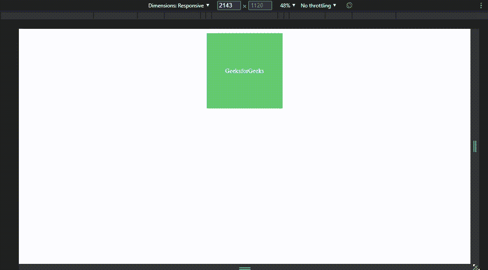

# 所有设备的 CSS3 媒体查询

> 原文:[https://www . geesforgeks . org/css3-media-查询所有设备/](https://www.geeksforgeeks.org/css3-media-query-for-all-devices/)

CSS 中的 [**媒体查询**](https://www.geeksforgeeks.org/css-media-queries/) 用来创建一个响应性的网页设计，以制作一个用户友好的网站。这意味着基于屏幕或媒体类型，网页的视图因系统而异。媒体允许我们为平板电脑、台式机、手机等特定设备重塑和设计网站的用户视图页面。

媒体查询可用于检查许多事情，例如

*   视口的宽度和高度
*   设备的宽度和高度
*   方向
*   解决

媒体查询由媒体类型组成，该媒体类型可以包含一个或多个表达式，这些表达式可以是*真*或*假*。如果指定的媒体与显示文档的设备类型匹配，则查询结果为*真*。如果媒体查询为*真*，则应用该样式。简单来说，就是基于一定的条件，使用[*@媒体规则*](https://www.geeksforgeeks.org/css-media-rule/) 来添加 CSS 属性的块。

**语法:**

```css
@media not | only mediatype and (expression)
{
    // Code content
}
```

我们可以添加断点来查看不同设备的屏幕宽度以及视口的宽度和高度。断点是一个点或键，用于确定何时通过在媒体查询中重新整形和添加新规则来更改布局。有一些常见的断点(不是标准分辨率)，可用于不同宽度和高度的设备:

*   适用于移动设备:320 像素至 480 像素
*   平板电脑或 iPad:480 像素-768 像素
*   适用于笔记本电脑或小尺寸屏幕:768 像素-1024 像素
*   桌面或大尺寸屏幕:1024px -1200px
*   超大尺寸设备: 1200px 及以上

这些断点可以帮助构建响应性设计(即。，移动优先设计)通过指定不同的宽度值组&高度。我们也可以使用的媒体查询来改变网页的布局，这将取决于浏览器的方向。

**示例:**该示例说明了如何使用 CSS Media 查询通过指定不同的设备宽度来构建移动优先设计。

## 超文本标记语言

```css
<!DOCTYPE html>
<html>

<head>
    <meta charset="utf-8">
    <meta http-equiv="X-UA-Compatible" content="IE=edge">
    <title>GeeksforGeeks CSS Media Query</title>
    <meta name="description"
          content="CSS Media Query for all devices
                       like mobile, tablet, desktop etc.">
    <meta name="viewport" content="width=device-width,
                                   initial-scale=1">
    <link rel="stylesheet" href="gfg-style.css">
</head>

<body>
    <div class="gfg-div">GeeksforGeeks</div>
</body>

</html>
```

**CSS 代码:**下面的 CSS 代码指定了基于某些条件的不同样式属性的媒体查询，这些查询将根据设备大小显示。

## 半铸钢ˌ钢性铸铁(Cast Semi-Steel)

```css
* {
  margin: 0;
  padding: 0;
}

/* Default Design */
.gfg-div {

  /* To make all elements center */
  display: flex;
  justify-content: center;
  align-items: center;

  /* Default Styling */
  margin: 20px auto;
  padding: 30px;
  font-size: 30px;
  width: 300px;
  height: 300px;
  background-color: darkseagreen;
  color: black;
}

/* For Desktop View */
@media screen and (min-width: 1024px) {
  .gfg-div {
    background-color: #63c971;
    color: #fff;
  }
}

/* For Tablet View */
@media screen and (min-device-width: 768px)
and (max-device-width: 1024px) {
  .gfg-div {
    width: 400px;
    height: 400px;
    background-color: orange;
    color: black;
  }
}

/* For Mobile Portrait View */
@media screen and (max-device-width: 480px)
and (orientation: portrait) {
  .gfg-div {
    width: 200px;
    height: 200px;
    background-color: red;
    color: #fff;
  }
}

/* For Mobile Landscape View */
@media screen and (max-device-width: 640px)
and (orientation: landscape) {
  .gfg-div {
    width: 400px;
    height: 200px;
    background-color: cyan;
    color: black;
  }
}

/* For Mobile Phones Portrait or Landscape View */
@media screen and (max-device-width: 640px) {
  .gfg-div {
    width: 400px;
    height: 200px;
    background-color: chartreuse;
    color: black;
  }
}

/* For iPhone 4 Portrait or Landscape View */
@media screen and (min-device-width: 320px)
and (-webkit-min-device-pixel-ratio: 2) {
  .gfg-div {
    width: 400px;
    height: 400px;
    background-color: brown;
    color: black;
  }
}

/* For iPhone 5 Portrait or Landscape View */
@media (device-height: 568px) and (device-width: 320px)
and (-webkit-min-device-pixel-ratio: 2) {
  .gfg-div {
    width: 400px;
    height: 400px;
    background-color: cornflowerblue;
    color: black;
  }
}

/* For iPhone 6 and 6 plus Portrait or Landscape View */
@media (min-device-height: 667px) and (min-device-width: 375px)
and (-webkit-min-device-pixel-ratio: 3) {
  .gfg-div {
    width: 400px;
    height: 400px;
    background-color: darkgoldenrod;
    color: black;
  }
}
```

**输出:**



**支持的浏览器:**

*   谷歌 Chrome
*   火狐浏览器
*   微软边缘
*   微软公司出品的 web 浏览器
*   歌剧
*   旅行队