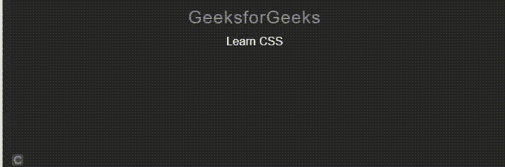

# 使用 jQuery 文本推理插件的 CSS3 文本动画

> 原文:[https://www . geesforgeks . org/css3-text-animation-using-jquery-text experie-plugin/](https://www.geeksforgeeks.org/css3-text-animation-using-jquery-textillate-plugin/)

在本文中，我们将使用 [jQuery 文本推理插件](https://github.com/jschr/textillate)学习一些基本的 [CSS3](https://www.geeksforgeeks.org/difference-between-css-and-css3/) 文本动画。

[Texttillate.js](https://github.com/jschr/textillate) 包含一些库给用户，一个易于使用的插件，用于将 CSS3 动画应用于任何文本。

**进场:**

*   [下载](https://github.com/jschr/textillate)一个文件夹中的所有依赖项。在执行下面给出的代码时，请注意文件路径的正确顺序。
*   在 HTML 文件的[头](https://www.geeksforgeeks.org/html-head-tag/)部分包含所有相关的 CSS 文件。
*   在代码的脚本部分包含所有的 JavaScript 文件。
*   给你想要应用动画的文本起一个 [*类*](https://www.geeksforgeeks.org/html-class-attribute/) 的名字。
*   在代码的 JavaScript 部分，使用文本的类名实例化**text experie()***方法，如下代码所示。*
*   *对于上述步骤，使用 [document.ready()](https://www.geeksforgeeks.org/how-to-run-a-code-on-document-ready-event-in-jquery/) 事件。*

***使用的库:***

> <link href="”assets/animate.css”" rel="”stylesheet”"> *<link href = " assets/style . CSS " rel = "样式表">
> <脚本 src = " http://Ajax . googleapis . com/Ajax/libs/jquery/1 . 9 . 0/jquery . min . js "></脚本>
> <脚本 src = " assets/jquery . fittext . js "></脚本>
> <脚本*

***示例 1:** 下面的代码演示了[“H2”](https://www.geeksforgeeks.org/html-heading/)文本上插件的**text experie()**方法的基本初始化。*

## *超文本标记语言*

```html
*<!DOCTYPE HTML>
<html>

<head>
    <meta charset="utf-8">
    <meta http-equiv="X-UA-Compatible" content="chrome=1">
    <meta name="viewport" content=
        "width=device-width, initial-scale=1.0">
    <link href="assets/animate.css" rel="stylesheet">
    <link href="assets/style.css" rel="stylesheet">
</head>

<body>
    <center>
        <h2 class="myClass">
            GeeksforGeeks
        </h2>

        <script src=
"http://ajax.googleapis.com/ajax/libs/jquery/1.9.0/jquery.min.js">
        </script>
        <script src="assets/jquery.fittext.js"></script>
        <script src="assets/jquery.lettering.js"></script>
        <script src="jquery.textillate.js"></script>
        <script>
            $(document).ready(function () {
                $('.myClass').textillate();
            });
        </script>
    </center>
</body>

</html>*
```

***输出:***

**

***示例 2:** 在下面的示例中，我们取了一个无序列表 [< ul >](https://www.geeksforgeeks.org/html-ul-tag/) 和列表项 [< li >](https://www.geeksforgeeks.org/html-li-tag/) 。动画效果显示为“淡出”和“淡入”，如下面的代码所示。为了更好地理解，请参考输出。*

## *超文本标记语言*

```html
*<!DOCTYPE HTML>
<html>

<head>
    <meta charset="utf-8">
    <meta http-equiv="X-UA-Compatible" content="chrome=1">
    <meta name="viewport" content=
        "width=device-width, initial-scale=1.0">
    <link href="assets/animate.css" rel="stylesheet">
    <link href="assets/style.css" rel="stylesheet">

</head>

<body>
    <center>
        <h2 style="color:green">GeeksforGeeks</h2>
        <p><b>Animate a list</b>
        <p>
        <h3 class="myClass">
            <ul class="texts">
                <li data-out-effect="fadeOut" 
                    data-out-shuffle="true">
                    Learn PHP
                </li>
                <li data-in-effect="fadeIn">
                    Learn CSS
                </li>
            </ul>
        </h3>

        <script src=
"http://ajax.googleapis.com/ajax/libs/jquery/1.9.0/jquery.min.js">
        </script>
        <script src="assets/jquery.fittext.js"></script>
        <script src="assets/jquery.lettering.js"></script>
        <script src="jquery.textillate.js"></script>

        <script>
            $(document).ready(function () {
                $('.myClass').textillate();

            });
        </script>
    </center>
</body>

</html>*
```

***输出:***

**

***示例 3:** 下面的代码演示了应用于代码脚本部分属性的不同选项。开发人员可以根据应用程序的需要尝试各种选项。下面显示的很少。*

## *超文本标记语言*

```html
*<!DOCTYPE HTML>
<html>

<head>
    <meta charset="utf-8">
    <meta http-equiv="X-UA-Compatible" content="chrome=1">
    <meta name="viewport" content=
        "width=device-width, initial-scale=1.0">
    <link href="assets/animate.css" rel="stylesheet">
    <link href="assets/style.css" rel="stylesheet">
</head>

<body>
    <center>
        <h2 style="color:green">
            GeeksforGeeks
        </h2>
        <p><b>Animate a list</b><p>
        <h3 class="myClass">
            <ul class="myTexts">
                <li data-out-effect="fadeOut" 
                    data-out-shuffle="true">
                    Learn PHP
                </li>
                <li data-in-effect="rollIn">
                    Learn CSS
                </li>
            </ul>
        </h3>

        <script src=
"http://ajax.googleapis.com/ajax/libs/jquery/1.9.0/jquery.min.js">
        </script>
        <script src="assets/jquery.fittext.js"></script>
        <script src="assets/jquery.lettering.js"></script>
        <script src="jquery.textillate.js"></script>

        <script>
            $(document).ready(function () {
                $('.myClass').textillate({

                    // Selector of multiple texts to animate
                    selector: '.myTexts',

                    // Enable looping
                    loop: false,

                    // Sets the minimum display time for
                    // each text before it is replaced
                    minDisplayTime: 3000,

                    // Sets the initial delay before
                    // starting the animation         
                    initialDelay: 50,

                    // Automatically start animating
                    autoStart: true,

                    // Character is shown/hidden 
                    // before or after animation
                    inEffects: [],

                    // Set 'out' effects
                    outEffects: ['hinge'],

                    // In animation settings
                    in: {
                        // Set the effect name
                        effect: 'fadeInLeftBig',

                        // Set the delay applied to
                        // each character
                        delayScale: 1.5,

                        // Set the delay between
                        // each character
                        delay: 100,

                        // Set to true to animate all the
                        // characters at the same time
                        sync: false,

                        // Randomize the character sequence            
                        shuffle: true,

                        // Reverse the character sequence            
                        reverse: true,

                        // Callback once the animation
                        // has finished
                        callback: function () { }
                    },

                    // Out animation settings.
                    out: {
                        effect: 'hinge',
                        delayScale: 1.5,
                        delay: 100,
                        sync: false,
                        shuffle: true,
                        reverse: true,
                        callback: function () { }
                    },

                    // Callback once textillate
                    // has finished
                    callback: function () { },

                    // Set type as 'char' or
                    // 'word'to animate 
                    type: 'word'
                });
            });
        </script>
    </center>
</body>

</html>*
```

***输出:***

**

***示例 4:** 下面的代码演示了 text experie 插件触发的事件处理。显示了“动画结束”和“动画开始”事件的示例。[在各种事件中抛出 JavaScript 警告消息](https://www.geeksforgeeks.org/how-to-use-the-alert-method-in-javascript/)。*

## *超文本标记语言*

```html
*<!DOCTYPE HTML>
<html>

<head>
    <meta charset="utf-8">
    <meta http-equiv="X-UA-Compatible" content="chrome=1">
    <meta name="viewport" content=
        "width=device-width, initial-scale=1.0">
    <link href="assets/animate.css" rel="stylesheet">
    <link href="assets/style.css" rel="stylesheet">
</head>

<body>
    <center>
        <h2 class="tlt">GeeksforGeeks</h2>
        <h3 class="tlt">
            <ul class="texts">
                <li data-out-effect="fadeOut" 
                    data-out-shuffle="true">
                    Learn PHP
                </li>
                <li data-in-effect="fadeIn">
                    Learn CSS
                </li>
            </ul>
        </h3>

        <script src=
"http://ajax.googleapis.com/ajax/libs/jquery/1.9.0/jquery.min.js">
        </script>
        <script src="assets/jquery.fittext.js"></script>
        <script src="assets/jquery.lettering.js"></script>
        <script src="jquery.textillate.js"></script>

        <script>
            $(document).ready(function () {
                $('.tlt').textillate();
                $('.tlt').on('inAnimationEnd.tlt', function () {
                    alert("In animation came to an end");
                });
                $('.tlt').on('outAnimationBegin.tlt', function () {
                    alert("Out animation Began");
                });
            });
        </script>
    </center>
</body>

</html>*
```

***输出:***

**