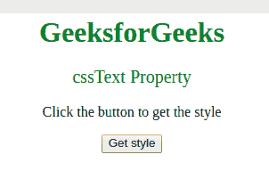
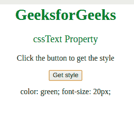
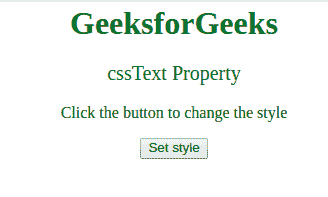
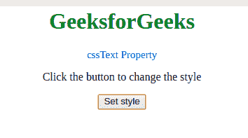

# CSS 样式声明 cssText 属性

> 原文:[https://www . geeksforgeeks . org/CSS style declaration-CSS text-property/](https://www.geeksforgeeks.org/cssstyledeclaration-csstext-property/)

**cssText** 属性用于**设置**或**返回** *元素的内嵌样式声明的值*。

**语法:**

*   它用于返回 cssText 属性。

    ```html
    element.style.cssText
    ```

*   它还用于设置 cssText 属性。

    ```html
    element.style.cssText = style
    ```

**属性值:**

*   **样式:**它是一个字符串文字，指定要添加到元素上的样式。

**返回值:**以字符串的形式返回元素的内联样式。

**示例-1:** 要获取 **cssText 属性**:

```html
<!DOCTYPE html>
<html>

<head>
    <title>
        CSS StyleDeclaration cssText Property
    </title>
    <style>
        body {
            text-align: center;
        }

        h1 {
            color: green;
        }
    </style>
</head>

<body>
    <h1>
      GeeksforGeeks
  </h1>

    <!-- Adding inline style -->
    <p id="p1" 
       style="color:green;
              font-size:20 ">
        cssText Property
  </p>

    <p>
      Click the button
      to get the style
  </p>

    <button onclick="myFunction()">
        Get style
    </button>

    <p id="gfg">
  </p>
    <!-- Script to get 
     cssText property -->
    <script>
        function myFunction() {
            var x = 
                document.getElementById(
                  "p1").style.cssText;

            document.getElementById(
              "gfg").innerHTML = x;
        }
    </script>
</body>

</html>
```

**输出:**

*   点击按钮前:
    
*   点击按钮后:
    

**示例-2:** 设置 **cssText 属性**:

```html
<!DOCTYPE html>
<html>

<head>
    <title>
        CSS StyleDeclaration cssText Property
    </title>
    <style>
        body {
            text-align: center;
        }

        h1 {
            color: green;
        }
    </style>
</head>

<body>
    <h1>GeeksforGeeks</h1>

    <!-- Adding inline style -->
    <p id="p1"
       style="color:green; 
              font-size:20 ">
        cssText Property
  </p>

    <p>
      Click the button to change the style
  </p>

    <button onclick="myFunction()">
        Set style
    </button>

    <p id="gfg"></p>
    <!-- Script to set cssText property -->
    <script>
        function myFunction() {
            document.getElementById(
              "p1").style.cssText = 
              "color:blue; font-size:15";
        }
    </script>
</body>

</html>
```

**输出:**

*   点击按钮前:
    
*   点击按钮后:
    

**支持的浏览器:***CSS 样式声明 cssText 属性*支持的浏览器如下:

*   谷歌 Chrome
*   微软公司出品的 web 浏览器
*   火狐浏览器
*   歌剧
*   旅行队