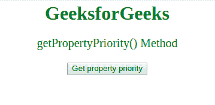
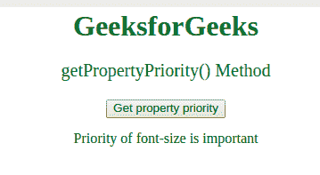

# CSS style declaration getPropertyPriority()方法

> 原文:[https://www . geesforgeks . org/csstyle declaration-getproperty priority-method/](https://www.geeksforgeeks.org/cssstyledeclaration-getpropertypriority-method/)

**getPropertyPriority()** 方法用于检查指定 CSS 属性*的优先级是否设置为“重要”*。

**语法:**

```html
object.getPropertyPriority(propertyname)

```

**参数:**接受单个参数:

*   **propertyname:** 它是一个必需的参数，包含一个代表要检查的属性名称的字符串。

**返回值:**以字符串的形式返回属性的优先级。如果它不存在，则返回一个空字符串。

**示例:**展示 **getPropertyPriority()** 方法的工作原理:

```html
<html>

<head>
    <style>
        body {
            text-align: center;
        }

        h1 {
            color: green;
        }

        #p1 {
            color: green;
            font-size: 20 !important;
        }
    </style>
</head>

<body>
    <h1>GeeksforGeeks</h1>

    <p id="p1">
      getPropertyPriority() Method
  </p>

    <button onclick="myFunction()">
        Get property priority
    </button>

    <p id="gfg"></p>

    <!-- Script to get the
       priority of the property -->
    <script>

        function myFunction() {

            var x = 
                document.styleSheets[
                  0].cssRules[2].style;

            var prior = 
                x.getPropertyPriority(
                  "font-size");

            document.getElementById("gfg").innerHTML =
                "Priority of font-size is " + prior;
        }
    </script>
</body>

</html>
```

**输出:**
**点击按钮前:**


**点击按钮后:**


**支持的浏览器:**

*   谷歌 Chrome
*   Internet Explorer 9.0
*   火狐浏览器
*   旅行队
*   歌剧