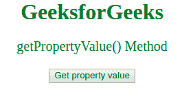
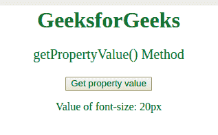

# csstyledeclaration getPropertyValue()方法

> 原文:[https://www . geesforgeks . org/csstyle declaration-getproperty value-method/](https://www.geeksforgeeks.org/cssstyledeclaration-getpropertyvalue-method/)

**getPropertyValue()** 方法用于**返回** *在声明块*中声明的 CSS 属性的值。

**语法:**

```css
object.getPropertyValue(propertyname)
```

**参数:**接受单个参数:

*   **propertyname:** 它是一个必需的参数，包含一个代表要检查的属性名称的字符串。

**返回值:**返回一个字符串，用于表示属性的值。

**示例:**要展示 getPropertyValue()方法的工作原理:

```css
<html>

<head>
    <style>
        body {
            text-align: center;
        }

        h1 {
            color: green;
        }

        #p1 {
            color: green;
            font-size: 20;
        }
    </style>
</head>

<body>
    <h1>GeeksforGeeks</h1>

    <p id="p1">
      getPropertyValue() Method
  </p>

    <button onclick="myFunction()">
        Get property value
    </button>

    <p id="gfg"></p>

    <!-- Script to get the 
         property value-->
    <script>
        function myFunction() {
            var x =
                document.styleSheets[
                  0].cssRules[2].style;

            document.getElementById(
              "gfg").innerHTML =
                " Value of font-size: "
            + x.getPropertyValue("font-size");
        }
    </script>
</body>

</html>
```

**输出:**
**点击按钮前:**


**点击按钮后:**


**支持的浏览器:**

*   谷歌 Chrome
*   Internet Explorer 9.0
*   火狐浏览器
*   旅行队
*   歌剧